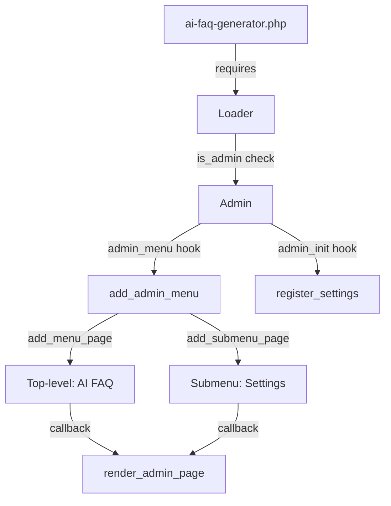

# Design Document: Admin Menu

## Overview

This design extends the existing `Admin` class in the AI FAQ Generator plugin to fully implement the admin menu requirements. The current `Admin` class already provides the foundational structure — registering a top-level menu page, settings, and rendering a settings page. The design adds a default "Settings" submenu item and ensures the architecture supports future submenu extensibility.

The implementation follows the existing patterns established in the codebase:
- WordPress function stubs for unit testing (no WordPress test framework dependency)
- PSR-4 autoloading via the `Loader` class with a manual class map
- PHPUnit 11 with DataProvider-based property testing

### Design Decisions

1. **Extend existing Admin class** rather than creating new classes — the current class already handles menu registration and settings. Adding submenu support is a natural extension.
2. **Use `add_submenu_page`** to register a "Settings" submenu item that points to the same callback as the top-level page, which is the standard WordPress pattern for renaming the first submenu entry.
3. **Keep the Loader unchanged** — it already instantiates Admin and calls `init()` in admin context, satisfying Requirement 3.

## Architecture



### Flow

1. Plugin bootstrap (`ai-faq-generator.php`) creates `Loader` and calls `init()`
2. `Loader::init()` checks `is_admin()`, instantiates `Admin`, calls `Admin::init()`
3. `Admin::init()` registers two hooks:
   - `admin_menu` → `add_admin_menu()`
   - `admin_init` → `register_settings()`
4. When WordPress fires `admin_menu`:
   - `add_menu_page()` registers the top-level "AI FAQ" entry with `dashicons-format-chat` icon
   - `add_submenu_page()` registers a "Settings" submenu pointing to the same page
5. When an admin clicks the menu item, `render_admin_page()` checks capability and renders the form

## Components and Interfaces

### Admin Class (Modified)

**File:** `admin/class-admin.php`  
**Namespace:** `WPBits\AiFaqGenerator\Admin`

```php
class Admin
{
    /**
     * Register WordPress hooks for admin menu and settings.
     */
    public function init(): void;

    /**
     * Register the top-level menu page and default submenu item.
     * Hooked to: admin_menu
     */
    public function add_admin_menu(): void;

    /**
     * Register plugin settings with the WordPress Settings API.
     * Hooked to: admin_init
     */
    public function register_settings(): void;

    /**
     * Render the settings page HTML.
     * Checks manage_options capability before producing output.
     */
    public function render_admin_page(): void;
}
```

### Key Method Changes

**`add_admin_menu()`** — Updated to also call `add_submenu_page()`:

```php
public function add_admin_menu(): void
{
    add_menu_page(
        'AI FAQ Generator Settings',
        'AI FAQ',
        'manage_options',
        'ai-faq-generator',
        [$this, 'render_admin_page'],
        'dashicons-format-chat',
        30
    );

    // Register default "Settings" submenu (replaces auto-generated first submenu)
    add_submenu_page(
        'ai-faq-generator',
        'AI FAQ Generator Settings',
        'Settings',
        'manage_options',
        'ai-faq-generator',
        [$this, 'render_admin_page']
    );
}
```

### Loader Class (Unchanged)

**File:** `includes/class-loader.php`  
**Namespace:** `WPBits\AiFaqGenerator\Includes`

No changes needed. The Loader already:
- Registers the autoloader
- Checks `is_admin()` before instantiating Admin
- Calls `$admin->init()`

## Data Models

### WordPress Settings

| Setting Group | Option Name | Description |
|---|---|---|
| `afg_settings` | `afg_settings` | Main plugin settings (array stored in wp_options) |

### Menu Registration Parameters

| Parameter | Value | Source Requirement |
|---|---|---|
| Page Title | `AI FAQ Generator Settings` | Req 2.2 |
| Menu Title | `AI FAQ` | Req 1.1 |
| Capability | `manage_options` | Req 1.3 |
| Menu Slug | `ai-faq-generator` | Req 1.4 |
| Icon | `dashicons-format-chat` | Req 1.2 |
| Position | `30` | — |

### Submenu Registration Parameters

| Parameter | Value | Source Requirement |
|---|---|---|
| Parent Slug | `ai-faq-generator` | Req 4.1 |
| Page Title | `AI FAQ Generator Settings` | Req 2.2 |
| Menu Title | `Settings` | Req 4.1 |
| Capability | `manage_options` | Req 1.3 |
| Menu Slug | `ai-faq-generator` | Req 4.1 |

## Error Handling

| Scenario | Handling | Requirement |
|---|---|---|
| User lacks `manage_options` capability | `render_admin_page()` returns early with no output | Req 2.4 |
| Menu slug conflict with another plugin | WordPress handles this internally — slug is unique via plugin prefix | — |
| Settings API failure | WordPress core handles validation; plugin relies on `register_setting` defaults | — |

The error handling is minimal because WordPress core manages most failure modes (permission checks via capabilities, menu slug uniqueness, settings API validation). The plugin's responsibility is limited to the capability guard in `render_admin_page()`.

## Testing Strategy

### Why Property-Based Testing Does Not Apply

This feature consists of WordPress hook registration and fixed-parameter API calls. The methods:
- Take no varying inputs (all parameters are hardcoded constants)
- Produce deterministic output for a given capability state (single boolean branch)
- Are WordPress API wiring — configuration, not data transformation or business logic

There is no meaningful "for all inputs X, property P(X) holds" statement possible here. The existing example-based unit tests with WordPress function stubs are the appropriate testing approach.

### Unit Testing Approach

The project already has a working test infrastructure with:
- PHPUnit 11 with `tests/bootstrap.php` providing WordPress function stubs
- Global trackers (`$afg_test_actions`, `$afg_test_menu_pages`, etc.) to verify hook registrations
- The existing `AdminTest.php` already covers most of the current behavior

**Tests to add/update for the new submenu functionality:**

1. **Submenu registration test** — Verify `add_submenu_page()` is called with correct parameters (parent slug, title, capability, slug)
2. **Menu title test** — Verify the top-level menu title is "AI FAQ" (currently "AI FAQ Generator")
3. **Icon test** — Verify `dashicons-format-chat` is passed as the icon parameter
4. **Hook registration test** — Already covered by existing `init_registers_admin_menu_and_admin_init_hooks`
5. **Capability guard test** — Already covered by existing `render_admin_page_returns_early_without_manage_options`
6. **Settings form rendering test** — Already covered by existing `render_admin_page_outputs_settings_form_when_authorized`

**New stub needed in `tests/bootstrap.php`:**

```php
global $afg_test_submenu_pages;
$afg_test_submenu_pages = [];

if (!function_exists('add_submenu_page')) {
    function add_submenu_page(
        string $parent_slug,
        string $page_title,
        string $menu_title,
        string $capability,
        string $menu_slug,
        $callback = '',
        ?int $position = null
    ): string|false {
        global $afg_test_submenu_pages;
        $afg_test_submenu_pages[] = [
            'parent_slug' => $parent_slug,
            'page_title' => $page_title,
            'menu_title' => $menu_title,
            'capability' => $capability,
            'menu_slug' => $menu_slug,
            'callback' => $callback,
            'position' => $position,
        ];
        return $menu_slug;
    }
}
```

### Test Coverage Matrix

| Requirement | Test | Type |
|---|---|---|
| 1.1 Menu displays "AI FAQ" | Assert menu_title equals "AI FAQ" | Unit |
| 1.2 Uses dashicons-format-chat | Assert icon_url parameter | Unit |
| 1.3 manage_options capability | Assert capability parameter | Unit |
| 1.4 ai-faq-generator slug | Assert menu_slug parameter | Unit |
| 2.1 Renders in div.wrap | Assert output contains `<div class="wrap">` | Unit |
| 2.2 Page heading | Assert output contains "AI FAQ Generator Settings" | Unit |
| 2.3 Settings API form | Assert settings_fields/do_settings_sections/submit_button called | Unit |
| 2.4 Capability guard | Assert empty output when capability is false | Unit |
| 3.1 admin_menu hook | Assert add_action called with 'admin_menu' | Unit |
| 3.2 admin_init hook | Assert add_action called with 'admin_init' | Unit |
| 3.3 Loader initializes Admin | Covered by existing Loader tests | Unit |
| 4.1 Default "Settings" submenu | Assert add_submenu_page called with correct params | Unit |
| 4.2 Supports additional submenus | Architectural (WordPress handles this natively) | — |

