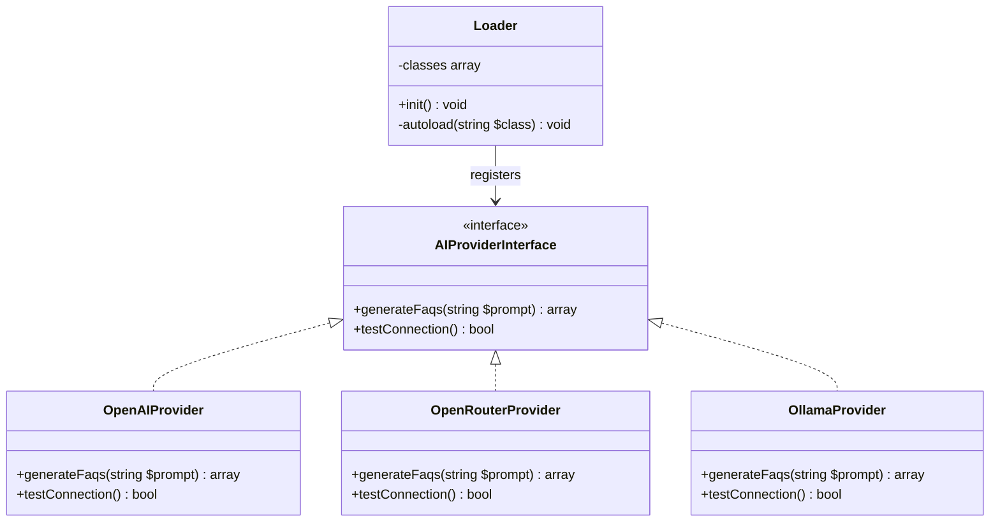

# Design Document: AI Provider Interface

## Overview

The AI Provider Interface establishes a pluggable architecture for the AI FAQ Generator plugin. It defines a PHP interface (`AIProviderInterface`) that all AI provider implementations must fulfill, enabling the plugin to work with multiple AI services (OpenAI, OpenRouter, Ollama, DeepSeek, LocalAI, LM Studio) interchangeably.

The design follows the Strategy pattern — the plugin core depends on the interface abstraction, and concrete providers are injected at runtime based on user configuration. This decouples FAQ generation logic from any specific AI service.

## Architecture



The interface sits in `includes/interfaces/class-ai-provider-interface.php` and is registered in the Loader's class map alongside existing classes. Any component needing FAQ generation accepts `AIProviderInterface` as a dependency rather than a concrete class.

## Components and Interfaces

### AIProviderInterface

**Location:** `includes/interfaces/class-ai-provider-interface.php`
**Namespace:** `WPBits\AiFaqGenerator\Includes\Interfaces`

```php
<?php
declare(strict_types=1);

namespace WPBits\AiFaqGenerator\Includes\Interfaces;

/**
 * Interface AIProviderInterface
 *
 * Defines the contract for AI service providers used by the FAQ generator.
 * Each provider (OpenAI, OpenRouter, Ollama, etc.) implements this interface
 * to enable pluggable AI service integration.
 *
 * @package WPBits\AiFaqGenerator\Includes\Interfaces
 */
interface AIProviderInterface
{
    /**
     * Generate FAQ items from the given prompt.
     *
     * Sends the prompt to the AI service and returns structured FAQ data.
     * Each FAQ item is an associative array with 'question' and 'answer' keys.
     *
     * @param string $prompt The instruction/context prompt for FAQ generation.
     * @return array<int, array{question: string, answer: string}> List of FAQ items.
     * @throws \RuntimeException When the AI service returns an error or invalid response.
     */
    public function generateFaqs(string $prompt): array;

    /**
     * Test the connection to the AI service.
     *
     * Verifies that the configured API endpoint is reachable and authentication
     * credentials are valid. Does not throw exceptions on failure.
     *
     * @return bool True if connection is successful, false otherwise.
     */
    public function testConnection(): bool;
}
```

### Loader Integration

The existing `Loader` class in `includes/class-loader.php` will be updated to include the interface in its class map:

```php
$this->classes = [
    'WPBits\\AiFaqGenerator\\Admin\\Admin' => AFG_PLUGIN_PATH . 'admin/class-admin.php',
    'WPBits\\AiFaqGenerator\\Admin\\Settings' => AFG_PLUGIN_PATH . 'admin/class-settings.php',
    'WPBits\\AiFaqGenerator\\Includes\\Interfaces\\AIProviderInterface' => AFG_PLUGIN_PATH . 'includes/interfaces/class-ai-provider-interface.php',
];
```

### Provider Factory (Future)

While not part of this immediate implementation, the architecture supports a factory pattern for provider instantiation:

```php
// Future usage pattern
function create_provider(string $provider_name, array $config): AIProviderInterface {
    return match($provider_name) {
        'openai' => new OpenAIProvider($config),
        'openrouter' => new OpenRouterProvider($config),
        default => throw new \InvalidArgumentException("Unknown provider: {$provider_name}"),
    };
}
```

## Data Models

### FAQ Item Structure

Each FAQ item returned by `generateFaqs()` follows this structure:

```php
[
    'question' => string,  // The FAQ question text
    'answer'   => string,  // The FAQ answer text
]
```

**Constraints:**
- Both `question` and `answer` must be non-empty strings
- The returned array is numerically indexed (0-based)
- The number of items returned depends on provider configuration (typically matches `faq_count` setting)

### Provider Configuration

Providers receive configuration from the plugin's settings (stored in `afg_settings` option):

| Field | Type | Description |
|-------|------|-------------|
| `api_key` | string | Authentication key for the AI service |
| `model` | string | Model identifier (e.g., `gpt-4o`) |
| `temperature` | float | Creativity parameter (0.0–2.0) |
| `faq_count` | int | Number of FAQ items to generate (1–20) |

## Correctness Properties

*A property is a characteristic or behavior that should hold true across all valid executions of a system — essentially, a formal statement about what the system should do. Properties serve as the bridge between human-readable specifications and machine-verifiable correctness guarantees.*

### Property 1: Interface contract enforcement

*For any* PHP class that implements `AIProviderInterface`, that class SHALL declare both `generateFaqs(string $prompt): array` and `testConnection(): bool` methods with the correct type signatures, or PHP will produce a fatal error.

**Validates: Requirements 1.1, 1.2, 4.1**

### Property 2: FAQ output structure invariant

*For any* valid (non-empty) prompt string passed to a conforming provider's `generateFaqs` method, every element in the returned array SHALL be an associative array containing both a `question` key with a string value and an `answer` key with a string value.

**Validates: Requirements 4.2**

### Property 3: testConnection never throws on failure

*For any* simulated connection failure condition, a conforming provider's `testConnection` method SHALL return `false` without throwing an exception.

**Validates: Requirements 4.5**

## Error Handling

### generateFaqs Error Strategy

When `generateFaqs` encounters an error from the AI service:

1. **API errors** (authentication failure, rate limiting, server errors): Throw `\RuntimeException` with a descriptive message including the HTTP status code and error detail.
2. **Malformed response** (AI returns non-JSON or missing fields): Throw `\RuntimeException` describing the parsing failure.
3. **Network errors** (timeout, DNS failure): Throw `\RuntimeException` wrapping the underlying connection error.

The caller (plugin core) is responsible for catching exceptions and presenting user-friendly error messages.

### testConnection Error Strategy

`testConnection` is designed as a safe probe — it never throws:

1. **Success**: Returns `true` when the service responds with a valid status.
2. **Any failure** (network, auth, server error): Returns `false`. Implementations should log the failure detail for debugging but not propagate exceptions.

## Testing Strategy

### Unit Tests

- Verify interface file exists at expected path
- Verify namespace and strict_types declaration
- Verify PHPDoc blocks exist on interface and methods
- Verify method signatures via reflection (parameter types, return types)
- Verify Loader class map includes the interface entry
- Verify autoloader resolves the interface FQCN

### Property-Based Tests

Property-based tests use PHPUnit with data providers generating 100+ test cases (following the existing `LoaderPropertyTest` pattern in the project).

- **Property 1**: Generate random class stubs implementing the interface and verify PHP enforces both method signatures via reflection.
- **Property 2**: Generate random valid prompt strings and verify a mock provider's output conforms to the FAQ_Item structure (array of `{question: string, answer: string}`).
- **Property 3**: Generate random failure conditions and verify `testConnection` returns `false` without throwing.

**Library**: PHPUnit 11 with `#[DataProvider]` attributes (consistent with existing tests).
**Minimum iterations**: 100 per property test.
**Tag format**: `Feature: ai-faq-generator-provider-interface, Property N: [property text]`

### Integration Tests

- Verify that a concrete provider implementation (mock) can be instantiated and used through the interface type hint.
- Verify the Loader autoloads the interface when referenced in application code.

