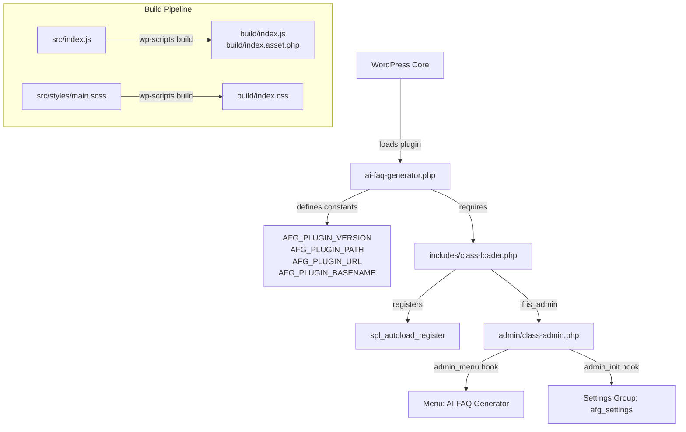

# Design Document: AI FAQ Generator Plugin Skeleton

## Overview

This design covers the foundational skeleton/bootstrap for the AI FAQ Generator WordPress plugin. The plugin follows the same architectural conventions as the existing `sample-plugin` in the workspace: a main entry file with constants, an SPL-based class autoloader, an admin settings page shell using the WordPress Settings API, and wp-scripts for asset compilation.

No AI functionality is included in this scope. The goal is a clean, extensible foundation that future features (AI content generation, Gutenberg blocks, etc.) can build upon.

### Key Design Decisions

1. **SPL autoload with explicit class map** — Matches the sample-plugin pattern. Simple, predictable, and avoids filesystem scanning overhead. The map is manually maintained, which is acceptable for a small plugin.
2. **Namespace `WPBits\AiFaqGenerator`** — Follows the project's vendor namespace convention.
3. **Constant prefix `AFG_`** — Short, unique, avoids collisions with other plugins.
4. **wp-scripts for builds** — Standard WordPress tooling, no custom webpack config needed.
5. **No public-facing module yet** — Unlike sample-plugin, this skeleton omits the `public/` directory since FAQ rendering will come in a later phase.

## Architecture



### Bootstrap Flow

1. WordPress loads `ai-faq-generator.php`
2. ABSPATH check — exit immediately if accessed directly
3. Constants defined (`AFG_PLUGIN_VERSION`, `AFG_PLUGIN_PATH`, `AFG_PLUGIN_URL`, `AFG_PLUGIN_BASENAME`)
4. `includes/class-loader.php` is required
5. `Loader` is instantiated and `init()` called
6. Loader registers SPL autoload callback
7. If `is_admin()` is true, `Admin` class is instantiated and initialized
8. Admin hooks into `admin_menu` and `admin_init`

## Components and Interfaces

### 1. Plugin Bootstrap (`ai-faq-generator.php`)

**Responsibility:** Entry point, constant definitions, loader initialization.

```php
<?php
/**
 * Plugin Name: AI FAQ Generator
 * Plugin URI: https://wpbits.net/ai-faq-generator
 * Description: AI-powered FAQ generation for WordPress
 * Version: 1.0.0
 * Author: WPBits
 * Author URI: https://wpbits.net
 * Text Domain: ai-faq-generator
 * Domain Path: /languages
 * Requires at least: 6.0
 * Requires PHP: 7.4
 * License: GPL-2.0-or-later
 */

declare(strict_types=1);

namespace WPBits\AiFaqGenerator;

if (!defined('ABSPATH')) {
    exit;
}

define('AFG_PLUGIN_VERSION', '1.0.0');
define('AFG_PLUGIN_PATH', plugin_dir_path(__FILE__));
define('AFG_PLUGIN_URL', plugin_dir_url(__FILE__));
define('AFG_PLUGIN_BASENAME', plugin_basename(__FILE__));

function init(): void
{
    require_once AFG_PLUGIN_PATH . 'includes/class-loader.php';
    $loader = new Includes\Loader();
    $loader->init();
}

init();
```

### 2. Loader (`includes/class-loader.php`)

**Responsibility:** SPL autoload registration, component initialization.

**Interface:**
- `__construct()` — Builds the class-to-file map
- `init(): void` — Registers autoloader, initializes components
- `autoload(string $class): void` — Resolves class to file path (private)

**Class Map:**
| Fully Qualified Class Name | File Path |
|---|---|
| `WPBits\AiFaqGenerator\Admin\Admin` | `admin/class-admin.php` |

**Behavior:**
- Only loads classes present in the internal map
- Silently ignores unknown classes (allows other autoloaders to handle them)
- Conditionally initializes Admin when `is_admin()` returns true

### 3. Admin (`admin/class-admin.php`)

**Responsibility:** WordPress admin menu registration, settings page rendering.

**Interface:**
- `init(): void` — Registers WordPress hooks
- `add_admin_menu(): void` — Adds top-level menu page
- `register_settings(): void` — Registers settings group and sections
- `render_admin_page(): void` — Outputs the settings page HTML

**Hook Registrations:**
| Hook | Callback | Priority |
|---|---|---|
| `admin_menu` | `add_admin_menu` | default (10) |
| `admin_init` | `register_settings` | default (10) |

**Menu Configuration:**
- Page title: "AI FAQ Generator Settings"
- Menu title: "AI FAQ Generator"
- Capability: `manage_options`
- Menu slug: `ai-faq-generator`
- Icon: `dashicons-format-chat`
- Position: 30

**Settings Configuration:**
- Settings group: `afg_settings`
- Settings section: `afg_main_section`
- Page slug: `ai-faq-generator`

### 4. Build Assets (`src/`)

**Entry point:** `src/index.js`
- Imports `./styles/main.scss`
- Placeholder for future admin UI JavaScript

**Styles:** `src/styles/main.scss`
- Scoped under `.afg-wrap` class
- Minimal placeholder styles for the admin page

## Data Models

This skeleton phase has no persistent data models. The settings registered via `register_setting` use WordPress's `wp_options` table. No custom tables or post types are introduced.

**Future consideration:** The `afg_settings` option group is registered but no individual options are defined yet. Options will be added in subsequent phases (e.g., API key storage, generation preferences).

## Correctness Properties

*A property is a characteristic or behavior that should hold true across all valid executions of a system — essentially, a formal statement about what the system should do. Properties serve as the bridge between human-readable specifications and machine-verifiable correctness guarantees.*

Given that this feature is primarily a plugin skeleton (file structure, configuration, WordPress hook wiring), most acceptance criteria are best validated through smoke tests and example-based unit tests. Only one criterion qualifies for property-based testing:

### Property 1: Autoloader ignores unregistered classes

*For any* fully-qualified class name that is not present in the Loader's internal class map, invoking the autoload callback SHALL have no side effects — it SHALL not throw an exception, not emit errors, and not load any files.

**Validates: Requirements 4.7**

## Error Handling

### Direct Access Prevention
- The main plugin file checks for `ABSPATH` and calls `exit` if undefined. This prevents direct PHP execution outside WordPress.

### Autoloader Safety
- The autoloader only acts on classes in its map. Unknown classes are silently ignored, preserving the SPL autoloader chain.
- Uses `require_once` to prevent double-loading.

### Admin Page Access Control
- `render_admin_page()` checks `current_user_can('manage_options')` before rendering. Returns early if the user lacks permission.

### Version Requirements
- The plugin header declares `Requires at least: 6.0` and `Requires PHP: 7.4`. WordPress core handles version enforcement during activation.

### Future Error Boundaries
- The skeleton establishes the pattern for error handling. Future phases (AI API calls, block rendering) will add try/catch boundaries and admin notices for runtime errors.

## Testing Strategy

### Approach

This is a plugin skeleton — the testing strategy emphasizes **smoke tests** and **example-based unit tests** over property-based testing. The codebase is small, the logic is straightforward, and most requirements are structural/configuration checks.

### Unit Tests (PHPUnit)

**Scope:** Loader behavior, Admin hook registration, constant definitions.

| Test | Type | Validates |
|---|---|---|
| Main file defines all AFG_ constants | Smoke | 2.3–2.6 |
| Main file exits without ABSPATH | Example | 2.8 |
| Loader registers SPL autoload function | Example | 4.3 |
| Loader maps Admin class correctly | Example | 4.4 |
| Loader initializes Admin when is_admin() | Example | 4.5 |
| Loader loads registered class file | Example | 4.6 |
| Loader ignores unregistered classes | Property | 4.7 |
| Admin registers menu with correct slug | Example | 5.3 |
| Admin uses manage_options capability | Example | 5.4 |
| Admin renders settings form | Example | 5.5 |
| Admin registers afg_settings group | Example | 5.6 |

### Property-Based Test

**Library:** PHPUnit with a data provider generating random class names.

**Configuration:**
- Minimum 100 iterations
- Tag: `Feature: ai-faq-generator, Property 1: Autoloader ignores unregistered classes`

**Generator:** Random fully-qualified class names (varying namespace depth, class name length, special characters in namespace segments).

### Integration Tests

| Test | Validates |
|---|---|
| Plugin activates without fatal errors | 3.1 |
| Plugin activates without warnings (WP_DEBUG) | 3.2 |
| Hooks registered after activation | 3.3 |
| Build produces index.js and index.asset.php | 6.5 |

### Static Analysis

- **PHPCS** with WordPress coding standards (already configured at workspace root via `.phpcs.xml`)
- **File structure validation** via a simple shell script or PHPUnit test that asserts expected files exist

### Build Verification

- `npm run build` produces `build/index.js` and `build/index.asset.php`
- Verified as part of CI pipeline

## File Structure

```
plugins/ai-faq-generator/
├── ai-faq-generator.php          # Main plugin entry
├── admin/
│   └── class-admin.php           # Admin settings page
├── blocks/
│   └── .gitkeep                  # Placeholder for future blocks
├── includes/
│   └── class-loader.php          # SPL autoloader
├── src/
│   ├── index.js                  # JS entry point
│   └── styles/
│       └── main.scss             # SCSS entry point
├── composer.json                 # PHP dependencies & PSR-4 autoload
└── package.json                  # Node dependencies & build scripts
```
