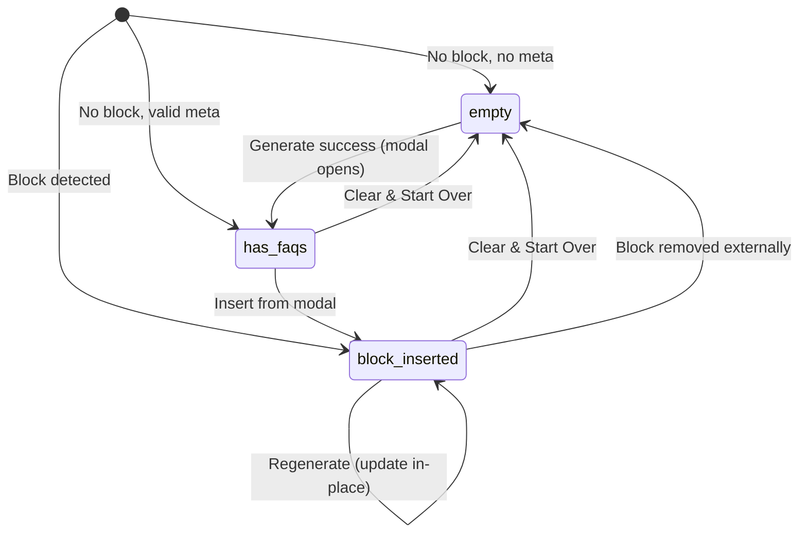
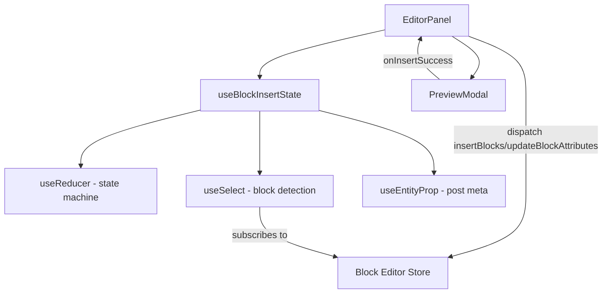

# Design Document: Block Insert State

## Overview

This feature introduces a finite state machine to the AI FAQ Generator's `EditorPanel` sidebar component. The state machine tracks whether an FAQ accordion block has been inserted into the post content, enabling the UI to show contextual actions (Edit Block, Regenerate, Clear & Start Over) and preventing duplicate block insertion on regeneration.

The core problem: currently, regenerating FAQs always inserts a new block, leading to duplicates. With this state machine, the sidebar knows whether a block already exists and can update it in-place instead of inserting another.

**Key design decisions:**
- **Custom hook (`useBlockInsertState`)** encapsulates all state machine logic for testability and separation of concerns
- **`useSelect` subscription** for block detection (reactive, no polling)
- **`useReducer`** for state transitions (explicit, predictable, testable)
- **Callback-based communication** between PreviewModal and EditorPanel (existing `onInsertSuccess` pattern)

## Architecture



### Component Architecture



The `useBlockInsertState` custom hook owns:
1. The current `sidebarState` value (`empty` | `has_faqs` | `block_inserted`)
2. The `activeBlockClientId` reference
3. Block detection via `useSelect` subscription
4. State transition logic via `useReducer`

`EditorPanel` consumes the hook and renders UI based on the state. `PreviewModal` remains largely unchanged — it still calls `onInsertSuccess` after insertion.

## Components and Interfaces

### `useBlockInsertState` Custom Hook

```typescript
interface BlockInsertState {
  sidebarState: 'empty' | 'has_faqs' | 'block_inserted';
  activeBlockClientId: string | null;
  faqCount: number;
  isRegenerating: boolean;
  error: string | null;
}

interface BlockInsertActions {
  handleGenerate: () => Promise<void>;
  handleInsertSuccess: (faqs: FaqItem[], clientId: string) => void;
  handleRegenerate: () => Promise<void>;
  handleEditBlock: () => void;
  handleClear: () => void;
}

function useBlockInsertState(postId: number, postType: string): [BlockInsertState, BlockInsertActions];
```

**Parameters:**
- `postId` — Current post ID (for AJAX calls)
- `postType` — Current post type (for `useEntityProp`)

**Returns:** A tuple of `[state, actions]` following React conventions.

### State Reducer

```typescript
type SidebarAction =
  | { type: 'BLOCK_DETECTED'; clientId: string }
  | { type: 'META_LOADED'; faqCount: number }
  | { type: 'INSERT_SUCCESS'; clientId: string }
  | { type: 'BLOCK_REMOVED' }
  | { type: 'CLEAR' }
  | { type: 'REGENERATE_START' }
  | { type: 'REGENERATE_SUCCESS' }
  | { type: 'REGENERATE_ERROR'; message: string }
  | { type: 'GENERATE_START' }
  | { type: 'GENERATE_SUCCESS'; faqCount: number }
  | { type: 'GENERATE_ERROR'; message: string }
  | { type: 'CLEAR_ERROR' };

function sidebarReducer(state: BlockInsertState, action: SidebarAction): BlockInsertState;
```

### `EditorPanel` Component (Modified)

The existing `EditorPanel` will be refactored to consume `useBlockInsertState`:

```javascript
function EditorPanel() {
  const [state, actions] = useBlockInsertState(postId, postType);
  // Render based on state.sidebarState
}
```

**UI states rendered:**
- `empty` → Generate FAQs button only
- `has_faqs` → FAQ count text + Generate button + Clear & Start Over button
- `block_inserted` → Success indicator + Edit Block + Regenerate + Clear & Start Over

### `PreviewModal` Component (Minimal Changes)

The `PreviewModal` interface remains the same. The `onInsertSuccess` callback now receives the inserted block's `clientId` in addition to the FAQ data:

```typescript
interface PreviewModalProps {
  faqs: FaqItem[];
  postId: number;
  onClose: () => void;
  onInsertSuccess: (faqs: FaqItem[], clientId: string) => void;
}
```

The `handleInsert` function in `PreviewModal` will capture the `clientId` from the created block and pass it to `onInsertSuccess`.

### Block Detection Logic

```javascript
// Inside useBlockInsertState
const faqBlock = useSelect((select) => {
  const blocks = select('core/block-editor').getBlocks();
  return findFaqBlock(blocks);
}, []);
```

**`findFaqBlock` utility:**
```javascript
function findFaqBlock(blocks) {
  for (const block of blocks) {
    if (block.name === 'wpbits/faq-accordion') {
      return { clientId: block.clientId, items: block.attributes.items };
    }
    if (block.innerBlocks?.length) {
      const found = findFaqBlock(block.innerBlocks);
      if (found) return found;
    }
  }
  return null;
}
```

This recursively traverses all blocks (including inner blocks) and returns the first `wpbits/faq-accordion` block found in document order.

## Data Models

### State Shape

```typescript
interface FaqItem {
  question: string;
  answer: string;
}

interface BlockInsertState {
  sidebarState: 'empty' | 'has_faqs' | 'block_inserted';
  activeBlockClientId: string | null;
  faqCount: number;
  isRegenerating: boolean;
  isGenerating: boolean;
  error: string | null;
}
```

### Initial State Derivation

On mount, the initial state is derived from two inputs:

| Block Exists? | Meta Valid? | Initial State    |
|---------------|-------------|------------------|
| Yes           | Any         | `block_inserted` |
| No            | Yes         | `has_faqs`       |
| No            | No          | `empty`          |

Block presence takes priority over meta content (Requirement 1.3).

### State Transitions Table

| Current State    | Event                  | Next State       | Side Effects                          |
|------------------|------------------------|------------------|---------------------------------------|
| `empty`          | Generate success       | `has_faqs`       | Open PreviewModal                     |
| `has_faqs`       | Insert from modal      | `block_inserted` | Clear meta, store clientId            |
| `has_faqs`       | Clear                  | `empty`          | Clear meta, reset local state         |
| `block_inserted` | Regenerate success     | `block_inserted` | Update block attributes               |
| `block_inserted` | Clear                  | `empty`          | Clear meta, remove clientId reference |
| `block_inserted` | Block removed          | `empty`          | Clear clientId, show notice           |
| `block_inserted` | Edit Block (missing)   | `empty`          | Show snackbar notice                  |
| Any              | Block detected on load | `block_inserted` | Store clientId                        |

### Post Meta

- **Key:** `_aifaq_generated_faqs`
- **Type:** JSON string (array of `FaqItem`) or empty string
- **Cleared:** On successful block insertion and on Clear & Start Over action
- **Written via:** `useEntityProp` (modifies editor entity state, does not auto-save)


## Correctness Properties

*A property is a characteristic or behavior that should hold true across all valid executions of a system — essentially, a formal statement about what the system should do. Properties serve as the bridge between human-readable specifications and machine-verifiable correctness guarantees.*

### Property 1: State Invariant

*For any* sequence of valid actions dispatched to the sidebar reducer, the resulting `sidebarState` value SHALL always be one of exactly three values: `empty`, `has_faqs`, or `block_inserted`.

**Validates: Requirements 1.1**

### Property 2: Initial State Derivation

*For any* combination of post meta value (valid JSON array, invalid JSON, empty string, null) and block existence (true/false), the initial state derivation function SHALL return:
- `block_inserted` when a block exists (regardless of meta value)
- `has_faqs` when no block exists and meta is a valid JSON array with at least one element
- `empty` when no block exists and meta is empty, null, invalid JSON, or an empty array

**Validates: Requirements 1.2, 1.3, 1.4, 6.3, 6.4**

### Property 3: Block Detection Finds First FAQ Block Recursively

*For any* block tree (including nested inner blocks at arbitrary depth), the `findFaqBlock` function SHALL return the first `wpbits/faq-accordion` block encountered in document order (depth-first traversal), or `null` if no such block exists anywhere in the tree.

**Validates: Requirements 6.1, 6.2, 8.1, 8.2**

### Property 4: CLEAR Action Resets to Initial State

*For any* valid `BlockInsertState` (regardless of current `sidebarState`, `activeBlockClientId`, `faqCount`, or error values), dispatching a `CLEAR` action to the reducer SHALL produce a state with `sidebarState: 'empty'`, `activeBlockClientId: null`, `faqCount: 0`, `isRegenerating: false`, `isGenerating: false`, and `error: null`.

**Validates: Requirements 2.6, 4.5**

### Property 5: Regeneration Preserves Block-Inserted State

*For any* state where `sidebarState` is `block_inserted`, dispatching a `REGENERATE_SUCCESS` action SHALL produce a state where `sidebarState` remains `block_inserted` and `activeBlockClientId` is unchanged.

**Validates: Requirements 5.3**

## Error Handling

### Insertion Errors

- If `dispatch('core/block-editor').insertBlocks()` throws, the state remains unchanged and an error message is set in state (Requirement 2.7)
- The error is displayed as inline text in the panel and auto-clears on the next successful action

### Regeneration Errors

- **Server error response:** Display the server-provided error message via `core/notices` snackbar, auto-dismiss after 8 seconds (Requirement 7.5)
- **Network error / timeout (30s):** Abort the request via `AbortController`, display "Could not reach the server" notice, auto-dismiss after 8 seconds (Requirement 7.6)
- In both cases: re-enable all buttons, set `isBusy` to false, retain current state

### Block Removal During Operations

- If the active FAQ block is removed while a regeneration is in progress, the completion handler checks block existence before updating attributes. If the block is gone, it inserts a new one (Requirement 5.5)
- If the user clicks "Edit Block" and the referenced block no longer exists, transition to `empty` and show a snackbar notice (Requirement 3.2)

### Meta Parsing Errors

- Invalid JSON in `_aifaq_generated_faqs` is treated as "no data" (same as empty string)
- The existing `parseFaqMeta` function already handles this gracefully with a try/catch

### Concurrent Action Prevention

- While any async operation (generate or regenerate) is in progress, all action buttons are disabled (Requirement 7.3)
- This prevents race conditions from multiple simultaneous AJAX calls

## Testing Strategy

### Property-Based Tests (fast-check)

The project already includes `fast-check` as a dev dependency. Property-based tests will validate the core logic:

| Property | Target Function | Generator Strategy |
|----------|----------------|-------------------|
| Property 1: State Invariant | `sidebarReducer` | Random sequences of valid `SidebarAction` objects |
| Property 2: Initial State Derivation | `deriveInitialState` | Random meta values × boolean block existence |
| Property 3: Block Detection | `findFaqBlock` | Random block trees with varying depth and block types |
| Property 4: CLEAR Resets State | `sidebarReducer` | Random valid states + CLEAR action |
| Property 5: Regeneration Preserves State | `sidebarReducer` | Random block_inserted states + REGENERATE_SUCCESS |

**Configuration:**
- Minimum 100 iterations per property
- Each test tagged with: `Feature: block-insert-state, Property {N}: {title}`
- Library: `fast-check` (already in `devDependencies`)

### Unit Tests (Jest + Testing Library)

Example-based tests for:
- **UI rendering per state:** Verify correct buttons/text appear for each `sidebarState` value
- **AJAX integration:** Mock `fetch` to test generate/regenerate flows end-to-end
- **Error handling:** Verify error notices appear and buttons re-enable on failures
- **Edit Block navigation:** Verify `selectBlock` dispatch with correct clientId
- **Clear action side effects:** Verify meta is cleared, no blocks removed
- **Button disable during loading:** Verify all buttons disabled while `isRegenerating` is true

### Test File Structure

```
src/editor/__tests__/
├── useBlockInsertState.test.js       # Hook logic tests
├── sidebarReducer.test.js            # Reducer unit + property tests
├── findFaqBlock.test.js              # Block detection utility + property tests
├── deriveInitialState.test.js        # Initial state logic + property tests
├── EditorPanel.test.js               # Component rendering tests
└── EditorPanel.integration.test.js   # Full flow integration tests
```

### What Is NOT Property-Tested

- UI rendering (button visibility, text content) → example-based render tests
- AJAX call mechanics (fetch, abort, timeout) → example-based with mocked fetch
- WordPress store dispatch calls → example-based with mocked dispatch
- Timing requirements (500ms transitions) → not unit-tested (UX constraint)
