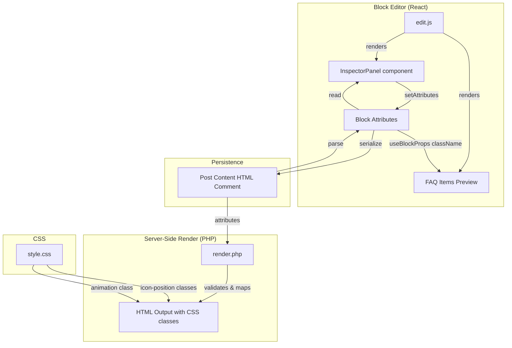

# Design Document

## Overview

This design specifies how to add an Inspector Panel (sidebar settings) to the `wpbits/faq-accordion` block. The panel provides four controls — Title Tag selector, Open First Item toggle, Icon Position selector, and Enable Animation toggle — that modify block attributes, are reflected in real-time in the editor preview, and drive CSS class output in the server-rendered frontend.

The architecture follows WordPress block development conventions: attributes defined in `block.json`, UI via `InspectorControls` from `@wordpress/block-editor`, editor preview via `useBlockProps` class injection, and frontend rendering via PHP with CSS class-based styling.

## Architecture



**Data flow:**
1. User changes a setting in the Inspector Panel → `setAttributes()` updates the block attribute
2. Editor preview reads attributes via `useBlockProps` and applies CSS classes to the wrapper
3. On save, attributes are serialized into the block comment delimiter in post content
4. On frontend render, `render.php` reads attributes, validates them, and outputs HTML with appropriate CSS classes

## Components and Interfaces

### New File: `blocks/faq-accordion/src/components/InspectorPanel.js`

A dedicated component for all inspector sidebar controls. Extracted from `edit.js` to keep the main edit component focused on content editing.

```javascript
// Props interface
{
  attributes: {
    titleTag: string,        // 'h2' | 'h3' | 'h4'
    openFirstItem: boolean,
    iconPosition: string,    // 'left' | 'right' | 'none'
    enableAnimation: boolean
  },
  setAttributes: (attrs: Partial<attributes>) => void
}
```

**Rationale:** Separating the inspector panel into its own component keeps `edit.js` readable and makes the panel independently testable.

### Modified File: `blocks/faq-accordion/src/edit.js`

Changes:
- Import `InspectorControls` from `@wordpress/block-editor`
- Import `InspectorPanel` component
- Destructure new attributes (`titleTag`, `openFirstItem`, `iconPosition`, `enableAnimation`)
- Compute CSS classes from attributes and pass to `useBlockProps({ className })`
- Render `<InspectorControls><InspectorPanel /></InspectorControls>` alongside existing content

```javascript
// CSS class computation logic
function getBlockClasses(attributes) {
  const { iconPosition, enableAnimation } = attributes;
  const classes = [];

  // Icon position class (always exactly one)
  if (iconPosition === 'right') classes.push('has-icon-right');
  else if (iconPosition === 'none') classes.push('has-no-icon');
  else classes.push('has-icon-left'); // default fallback

  // Animation class
  if (enableAnimation) classes.push('has-animation');

  return classes.join(' ');
}
```

### Modified File: `blocks/faq-accordion/block.json`

Add four new attributes to the `attributes` object:

```json
{
  "titleTag": { "type": "string", "default": "h3" },
  "openFirstItem": { "type": "boolean", "default": false },
  "iconPosition": { "type": "string", "default": "left" },
  "enableAnimation": { "type": "boolean", "default": false }
}
```

WordPress core handles attribute persistence and restoration automatically from this schema.

### Modified File: `blocks/faq-accordion/render.php`

Changes to `render_faq_accordion_block()`:
1. Read and validate new attributes with fallbacks
2. Build CSS class string for the wrapper `<div>`
3. Wrap question text in the appropriate heading tag inside `<summary>`
4. Conditionally add `open` attribute to first `<details>` element

```php
// Attribute validation logic
function get_validated_title_tag(array $attributes): string {
    $tag = $attributes['titleTag'] ?? 'h3';
    return in_array($tag, ['h2', 'h3', 'h4'], true) ? $tag : 'h3';
}

function get_validated_icon_position(array $attributes): string {
    $pos = $attributes['iconPosition'] ?? 'left';
    return in_array($pos, ['left', 'right', 'none'], true) ? $pos : 'left';
}

function get_validated_boolean(array $attributes, string $key): bool {
    return isset($attributes[$key]) && $attributes[$key] === true;
}
```

### Modified File: `blocks/faq-accordion/style.css`

New CSS rules for icon position variants and animation:

```css
/* Icon position: right — move chevron after text */
.wp-block-wpbits-faq-accordion.has-icon-right .faq-accordion-item summary {
  flex-direction: row-reverse;
  justify-content: space-between;
}

/* Icon position: none — hide chevron */
.wp-block-wpbits-faq-accordion.has-no-icon .faq-accordion-item summary::before {
  display: none;
}

/* Animation using grid-template-rows trick for <details> */
.wp-block-wpbits-faq-accordion.has-animation .faq-accordion-content {
  display: grid;
  grid-template-rows: 0fr;
  transition: grid-template-rows 300ms ease;
  overflow: hidden;
  padding: 0;
}

.wp-block-wpbits-faq-accordion.has-animation .faq-accordion-item[open] .faq-accordion-content {
  grid-template-rows: 1fr;
  padding: 1em 1.25em 1.25em;
}

/* Respect reduced motion */
@media (prefers-reduced-motion: reduce) {
  .wp-block-wpbits-faq-accordion.has-animation .faq-accordion-content {
    transition: none;
  }
}
```

**Design Decisions:**

1. **Icon position via `flex-direction: row-reverse`** instead of `::after` pseudo-element — reuses the existing `::before` chevron and simply reverses flex direction. Fewer CSS rules and no duplicate chevron styles.

2. **Animation via `grid-template-rows`** — the native `<details>` element doesn't support `height: auto` transitions. The `grid-template-rows: 0fr → 1fr` technique allows smooth height animation without JavaScript. Requires wrapping content in a grid context.

3. **InspectorPanel as separate component** — keeps `edit.js` focused on content editing logic and makes the sidebar independently testable.

4. **CSS class strategy on wrapper** — all visual variants use CSS classes on the block wrapper (`.wp-block-wpbits-faq-accordion`), which works for both editor preview (via `useBlockProps`) and frontend (via render.php). No inline styles needed.

## Data Models

### Block Attributes Schema (block.json)

| Attribute | Type | Default | Valid Values | Fallback |
|-----------|------|---------|--------------|----------|
| `items` | array | `[]` | Array of `{question, answer}` objects | `[]` |
| `titleTag` | string | `"h3"` | `"h2"`, `"h3"`, `"h4"` | `"h3"` |
| `openFirstItem` | boolean | `false` | `true`, `false` | `false` |
| `iconPosition` | string | `"left"` | `"left"`, `"right"`, `"none"` | `"left"` |
| `enableAnimation` | boolean | `false` | `true`, `false` | `false` |

### CSS Class Mapping

| Attribute Value | CSS Class Applied |
|-----------------|-------------------|
| `iconPosition: "left"` | `has-icon-left` |
| `iconPosition: "right"` | `has-icon-right` |
| `iconPosition: "none"` | `has-no-icon` |
| `enableAnimation: true` | `has-animation` |

### Serialized Block Format

```html
<!-- wp:wpbits/faq-accordion {"items":[...],"titleTag":"h3","openFirstItem":false,"iconPosition":"left","enableAnimation":false} -->
<!-- /wp:wpbits/faq-accordion -->
```

## Correctness Properties

*A property is a characteristic or behavior that should hold true across all valid executions of a system — essentially, a formal statement about what the system should do. Properties serve as the bridge between human-readable specifications and machine-verifiable correctness guarantees.*

### Property 1: Title tag renders correct heading inside summary

*For any* valid FAQ item (non-empty question and answer) and *for any* valid titleTag value (`h2`, `h3`, or `h4`), the rendered HTML SHALL contain the question text wrapped inside the specified heading element within a `<summary>` element (i.e., `<summary><hN>question</hN></summary>`).

**Validates: Requirements 2.5, 7.1**

### Property 2: Invalid title tag falls back to h3

*For any* string value that is not one of `h2`, `h3`, or `h4` (including empty string, null, undefined, or arbitrary strings), the render function SHALL produce output using `h3` as the heading element.

**Validates: Requirements 2.6, 7.5**

### Property 3: Open first item applies open attribute exclusively to first details

*For any* non-empty list of valid FAQ items with `openFirstItem` set to `true`, the rendered HTML SHALL have the `open` attribute on the first `<details>` element only, and no other `<details>` elements SHALL have the `open` attribute. When `openFirstItem` is `false`, no `<details>` element SHALL have the `open` attribute.

**Validates: Requirements 3.7, 3.8, 7.2**

### Property 4: Icon position maps to exactly one correct CSS class

*For any* valid `iconPosition` value (`left`, `right`, or `none`) and *for any* non-empty list of FAQ items, the rendered block wrapper SHALL contain exactly one icon-position CSS class: `has-icon-left` for `left`, `has-icon-right` for `right`, or `has-no-icon` for `none`. No other icon-position classes SHALL be present.

**Validates: Requirements 4.5, 4.6, 4.7, 7.3**

### Property 5: Invalid icon position falls back to has-icon-left

*For any* string value that is not one of `left`, `right`, or `none`, the render function SHALL apply the `has-icon-left` CSS class to the wrapper element.

**Validates: Requirements 4.8, 7.6**

### Property 6: Animation class presence matches boolean attribute

*For any* non-empty list of FAQ items, when `enableAnimation` is `true` the rendered wrapper SHALL contain the `has-animation` CSS class, and when `enableAnimation` is `false` the rendered wrapper SHALL NOT contain the `has-animation` CSS class.

**Validates: Requirements 5.4, 7.4**

### Property 7: Non-boolean attribute values treated as false

*For any* value that is not a boolean `true` for `openFirstItem` or `enableAnimation` (including strings, numbers, null, undefined, objects), the render function SHALL behave as if the attribute is `false` — no `open` attribute on any `<details>` element and no `has-animation` class on the wrapper.

**Validates: Requirements 6.5, 7.7**

## Error Handling

### Editor-Side

- **Invalid attribute values from storage**: WordPress core type-checks attributes against `block.json` schema. If a value doesn't match its type, WP applies the defined default. No custom error handling needed in JS.
- **Component errors**: React error boundaries in the block editor catch rendering failures. The InspectorPanel uses standard WP components that handle their own error states.

### Frontend (render.php)

- **Missing attributes**: All attribute reads use null coalescing (`??`) with safe defaults. Missing attributes never cause errors.
- **Invalid string attributes**: Explicit allowlist validation (`in_array` with strict comparison). Invalid values fall back to defaults.
- **Invalid boolean attributes**: Strict `=== true` comparison ensures only boolean `true` activates behavior. Any other value (including truthy strings) is treated as `false`.
- **Empty items array**: The existing early return (`if empty($items)`) prevents rendering an empty wrapper. No changes needed.
- **XSS in FAQ content**: Existing `wp_kses_post()` sanitization on question/answer text is preserved. The heading tag is from an allowlist, never from user input directly.

### CSS

- **Missing classes**: CSS rules are additive. If a class is missing, the default styles apply (icon on left, no animation). No broken states possible.
- **Browser compatibility**: The `grid-template-rows` animation technique works in all modern browsers (Chrome 57+, Firefox 52+, Safari 10.1+). Older browsers simply don't animate — content still shows/hides via native `<details>` behavior. Graceful degradation.

## Testing Strategy

### Unit Tests (Jest + @testing-library/react)

Tests for the React components using the existing mock infrastructure:

1. **InspectorPanel rendering** — verify all four controls render with correct labels and options
2. **Attribute updates** — verify each control calls `setAttributes` with correct values on interaction
3. **CSS class computation** — verify `getBlockClasses()` returns correct classes for all attribute combinations
4. **Editor preview** — verify `edit.js` applies correct classes via `useBlockProps` and reflects `openFirstItem` state
5. **Default values** — verify block.json schema defines correct defaults

### Property-Based Tests (Jest + fast-check)

Property-based testing is appropriate here because the render logic (both JS class computation and PHP output) has clear input/output behavior with a large input space (arbitrary FAQ items × attribute combinations). The `getBlockClasses()` function and PHP validation functions are pure functions with universal properties.

**Configuration:**
- Library: `fast-check` (already in devDependencies)
- Minimum iterations: 100 per property
- Tag format: `Feature: block-inspector-controls, Property N: <description>`

Tests target the pure logic functions:
- `getBlockClasses()` — JS function for CSS class computation
- Validation/fallback logic extracted into testable helper functions
- PHP render output assertions via helper that simulates attribute → class mapping

Each correctness property from the design maps to one property-based test.

### Integration Tests (PHP / PHPUnit)

- `render_faq_accordion_block()` output with various attribute combinations
- Backward compatibility: rendering blocks without new attributes uses defaults
- Sanitization: HTML escaping in heading tags works correctly

### Manual Testing Checklist

- Verify animation smoothness in Chrome, Firefox, Safari
- Verify `prefers-reduced-motion` disables animation
- Verify existing blocks without new attributes render without block validation errors
- Verify block serialization/deserialization roundtrip in editor
