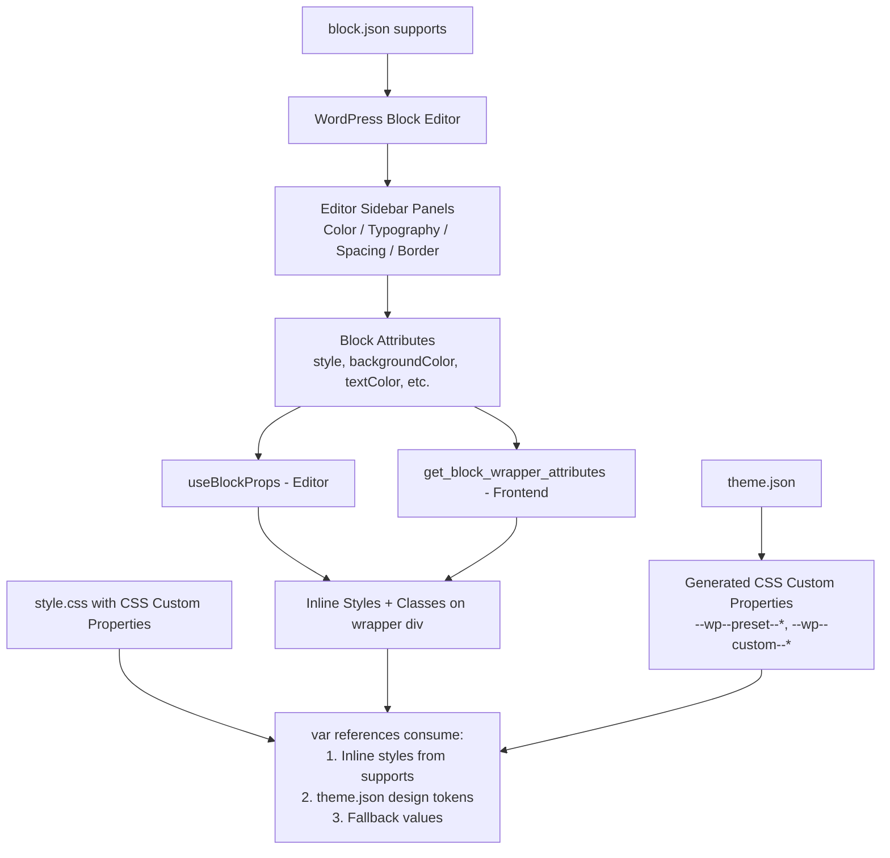

# Design Document: Block Theme Support

## Overview

This design describes how the FAQ Accordion block (`wpbits/faq-accordion`) will integrate with WordPress's native block supports system to enable theme-controlled styling through `theme.json`. The implementation involves three layers of changes:

1. **block.json supports declaration** — Enabling color, typography, spacing, and border panels in the editor sidebar.
2. **CSS custom property migration** — Replacing all hardcoded CSS values with `var()` references that consume either user-set values, theme.json tokens, or built-in fallbacks.
3. **Server-side render adjustments** — Using `get_block_wrapper_attributes()` so WordPress can inject supports-generated classes and inline styles into the block wrapper.

The block already uses a dynamic rendering pattern (`save()` returns `null`, server renders via `render.php`), which simplifies the integration — no HTML migration or block validation issues will arise.

## Architecture



### Design Decisions

1. **No render.php wrapper change needed for supports classes** — Currently `render.php` builds the wrapper `<div>` manually. We will switch to using `get_block_wrapper_attributes()` which automatically merges supports-generated classes/styles with our custom classes. This is the standard WordPress pattern for dynamic blocks with supports.

2. **CSS custom property naming convention** — We use the `--wp--custom--faq-accordion--*` namespace for block-specific tokens. This follows WordPress conventions and allows themes to override values via `theme.json` under `settings.custom.faq-accordion.*`.

3. **Fallback-first approach** — Every `var()` reference includes a fallback that matches the current hardcoded value. This guarantees zero visual regression for existing installations regardless of theme type (classic or block).

4. **No JavaScript changes for supports** — WordPress automatically handles the editor-side UI panels and attribute storage when supports are declared in `block.json`. The `edit.js` component already uses `useBlockProps()`, which will automatically apply supports-generated styles and classes.

## Components and Interfaces

### 1. block.json — Supports Declaration

The `supports` object in `block.json` will be extended:

```json
{
    "supports": {
        "html": false,
        "align": ["wide", "full"],
        "multiple": false,
        "color": {
            "text": true,
            "background": true,
            "link": true
        },
        "typography": {
            "fontSize": true,
            "lineHeight": true
        },
        "spacing": {
            "padding": true,
            "margin": true
        },
        "border": {
            "color": true,
            "style": true,
            "width": true,
            "radius": true
        }
    }
}
```

**Interface**: WordPress reads this declaration at block registration time. It automatically:
- Registers the corresponding attributes (`style`, `backgroundColor`, `textColor`, `fontSize`, etc.)
- Renders editor sidebar panels
- Generates inline styles and/or preset classes for the wrapper element

### 2. render.php — Wrapper Attributes Integration

The `render_faq_accordion_block()` function will be updated to use `get_block_wrapper_attributes()`:

```php
// Before (manual class building):
$output = '<div class="' . esc_attr($classes) . '">';

// After (WordPress merges supports styles/classes):
$wrapper_attributes = get_block_wrapper_attributes(['class' => $extra_classes]);
$output = '<div ' . $wrapper_attributes . '>';
```

**Interface**: `get_block_wrapper_attributes(array $extra_attributes = []): string`
- Accepts an optional array of extra attributes (like our icon/animation classes)
- Returns a complete attribute string including `class="..."` and `style="..."` with all supports-generated values merged in
- The second parameter to the render callback (`$content`) is unused; we use `$block` (third parameter) implicitly via WordPress globals

### 3. style.css — CSS Custom Property Migration

All hardcoded values will be replaced with CSS custom properties following this mapping:

| Original Value | Custom Property | Fallback |
|---|---|---|
| `#ddd` (border) | `--wp--custom--faq-accordion--border-color` | `#ddd` |
| `#f9f9f9` (header bg) | `--wp--custom--faq-accordion--header-background` | `#f9f9f9` |
| `#0073aa` (accent) | `--wp--custom--faq-accordion--accent-color` | `#0073aa` |
| `#f0f0f0` (hover bg) | `--wp--custom--faq-accordion--hover-background` | `#f0f0f0` |
| `#eee` (separator) | `--wp--custom--faq-accordion--separator-color` | `#eee` |
| `1em 1.25em` (padding) | `--wp--custom--faq-accordion--header-padding` | `1em 1.25em` |
| `1em 1.25em 1.25em` (content padding) | `--wp--custom--faq-accordion--content-padding` | `1em 1.25em 1.25em` |
| `4px` (border-radius) | `--wp--custom--faq-accordion--border-radius` | `4px` |

### 4. edit.js — No Structural Changes

The editor component already uses `useBlockProps({ className })`. When supports are declared, WordPress automatically adds the supports-generated inline styles and preset classes to the props returned by `useBlockProps()`. No code changes are needed in `edit.js` for the supports to work.

The `getBlockClasses()` utility continues to provide icon-position and animation classes as before.

## Data Models

### Block Attributes (Additions via Supports)

WordPress automatically registers these attributes when the corresponding supports are declared. They are stored in the block comment delimiter in the post content.

```
<!-- wp:wpbits/faq-accordion {"items":[...],"style":{"color":{"text":"#333","background":"#fff"},"typography":{"fontSize":"18px","lineHeight":"1.5"},"spacing":{"padding":{"top":"2em","right":"2em","bottom":"2em","left":"2em"}},"border":{"color":"#ccc","width":"2px","radius":"8px"}}} /-->
```

| Attribute | Type | Source | Description |
|---|---|---|---|
| `style` | `object` | WordPress supports | Nested object containing user-set values for color, typography, spacing, border |
| `backgroundColor` | `string` | WordPress supports | Preset slug reference (e.g., `"primary"`) |
| `textColor` | `string` | WordPress supports | Preset slug reference |
| `fontSize` | `string` | WordPress supports | Preset slug reference (e.g., `"large"`) |

These attributes are managed entirely by WordPress core — we do not read or write them manually.

### theme.json Custom Block Tokens

Themes can define custom values consumed by the block's CSS:

```json
{
    "settings": {
        "custom": {
            "faq-accordion": {
                "border-color": "#e0e0e0",
                "header-background": "#fafafa",
                "accent-color": "#005a87",
                "hover-background": "#f5f5f5",
                "separator-color": "#e8e8e8",
                "header-padding": "1.25em 1.5em",
                "content-padding": "1.25em 1.5em 1.5em",
                "border-radius": "6px"
            }
        }
    }
}
```

WordPress generates CSS custom properties from this: `--wp--custom--faq-accordion--border-color: #e0e0e0;` etc.

### theme.json Block-Level Styling

Themes can also target the block directly for supports-level overrides:

```json
{
    "styles": {
        "blocks": {
            "wpbits/faq-accordion": {
                "color": {
                    "text": "#222",
                    "background": "#ffffff"
                },
                "typography": {
                    "fontSize": "16px"
                },
                "spacing": {
                    "padding": {
                        "top": "1.5em",
                        "bottom": "1.5em"
                    }
                },
                "border": {
                    "color": "#ddd",
                    "width": "1px",
                    "radius": "4px"
                }
            }
        }
    }
}
```

## Correctness Properties

*A property is a characteristic or behavior that should hold true across all valid executions of a system — essentially, a formal statement about what the system should do. Properties serve as the bridge between human-readable specifications and machine-verifiable correctness guarantees.*

### Property 1: CSS custom property fallback preservation

*For any* CSS custom property defined in the FAQ Accordion stylesheet, the fallback value specified in the `var()` function SHALL exactly match the original hardcoded value it replaces, ensuring zero visual regression when no theme.json or user overrides are active.

**Validates: Requirements 5.8, 7.1, 7.2, 7.5**

### Property 2: Render output includes wrapper attributes

*For any* valid set of FAQ block attributes (with or without supports-generated style values), the rendered HTML output SHALL contain the `get_block_wrapper_attributes()` output including both the custom block classes (icon position, animation) and any WordPress supports-generated classes and inline styles.

**Validates: Requirements 1.3, 1.4, 2.3, 3.3, 3.4, 4.3, 7.3**

## Error Handling

### Backward Compatibility

- **Classic themes (no theme.json)**: CSS custom properties resolve to their fallback values, producing identical visual output to the current implementation.
- **Block themes without custom FAQ tokens**: Same behavior — fallbacks are used. The block supports panels still appear and function.
- **Existing block instances**: Since `save()` returns `null`, there is no serialized HTML to validate. Block attributes are backward-compatible (new attributes are additive with defaults handled by WordPress).
- **Missing `get_block_wrapper_attributes()`**: This function exists since WordPress 5.9. The plugin already requires WP 6.0+, so no compatibility check is needed.

### CSS Specificity

- WordPress supports-generated inline styles have the highest specificity and will always override our CSS custom property values. This is the correct behavior — user choices > theme defaults > block defaults.
- The CSS cascade order: block stylesheet (lowest) → theme.json block styles → user inline styles (highest).

### Edge Cases

- **Partially set supports values**: If a user sets only background color but not text color, WordPress applies only the background inline style. Our CSS handles this gracefully because each property is independent.
- **Invalid theme.json custom values**: WordPress sanitizes theme.json values during generation. Invalid values simply won't produce CSS custom properties, and our fallbacks will be used.

## Testing Strategy

### Approach

This feature is primarily **declarative configuration** (block.json changes) and **CSS structural migration** (hardcoded → custom properties). The runtime behavior is handled almost entirely by WordPress core. Property-based testing is **not applicable** because:

- There are no pure functions with varying inputs to test
- The CSS migration is a finite, known mapping (8 specific values → 8 custom properties)
- Block supports behavior is WordPress built-in — we declare, WordPress implements
- The feature doesn't involve parsers, serializers, or algorithmic logic

### Unit Tests (Jest + @testing-library/react)

1. **block.json structure validation**
   - Verify color support declares `text`, `background`, `link` as `true`
   - Verify typography support declares `fontSize` and `lineHeight` as `true`
   - Verify spacing support declares `padding` and `margin` as `true`
   - Verify border support declares `color`, `style`, `width`, `radius` as `true`
   - Verify existing supports (`html`, `align`, `multiple`) are preserved

2. **CSS custom property coverage**
   - Verify no hardcoded color values remain in the compiled stylesheet
   - Verify each custom property has the correct fallback value matching the original

3. **Editor component rendering**
   - Verify `useBlockProps` is called (ensures supports integration)
   - Verify custom classes (icon position, animation) are still applied alongside supports classes

### Integration Tests (wp-env + Playwright or manual)

4. **Editor panel presence**
   - Verify color, typography, spacing, and border panels appear in the sidebar when the block is selected

5. **Frontend rendering with theme.json**
   - Verify theme.json block-level styles are applied
   - Verify theme.json custom tokens are consumed by the block CSS
   - Verify user overrides take precedence over theme.json values

6. **Backward compatibility**
   - Verify rendering without theme.json matches current visual output
   - Verify existing block instances load without validation errors

### PHP Unit Tests (PHPUnit)

7. **render.php wrapper attributes**
   - Verify `get_block_wrapper_attributes()` output includes custom classes
   - Verify supports-generated classes and styles are present in rendered HTML
   - Verify the block renders correctly with various attribute combinations

### Test Commands

```bash
# JavaScript unit tests
npm run test:unit

# PHP unit tests (from monorepo root)
composer test

# Build verification
npm run build
```
