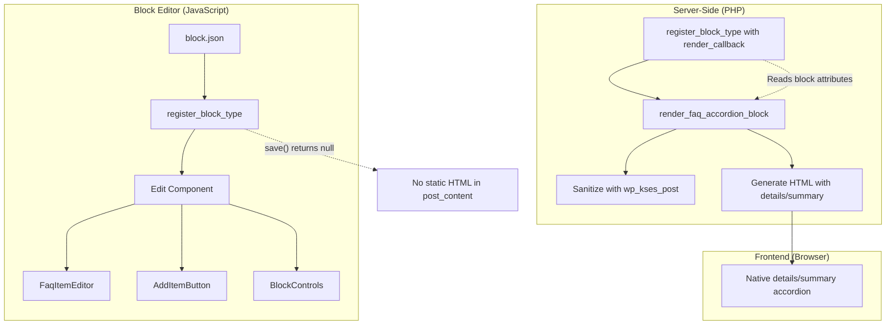

# Design Document: FAQ Accordion Block

## Overview

The FAQ Accordion Block is a custom Gutenberg block (`wpbits/faq-accordion`) that allows content editors to create and manage FAQ items directly in the WordPress block editor, and renders them as an accessible, collapsible accordion on the frontend. The block uses a dynamic rendering approach — the editor interface is built with `wp.element` components for inline editing, while the frontend HTML is generated server-side via a PHP `render_callback`.

Key design decisions:
- **Dynamic block rendering**: Frontend HTML is generated by PHP, not saved as static HTML. This allows output changes without block deprecation migrations.
- **Native `<details>`/`<summary>` elements**: Provides built-in accessibility and keyboard support without custom JavaScript on the frontend.
- **Inline editor UI**: FAQ items are edited directly in the block canvas (not in the sidebar), providing a WYSIWYG-like experience.

## Architecture



### File Structure

```
blocks/faq-accordion/
├── block.json              # Block metadata (name, attributes, scripts, styles)
├── src/
│   ├── index.js            # Block registration (registerBlockType)
│   ├── edit.js             # Edit component (editor interface)
│   ├── save.js             # Save component (returns null)
│   ├── editor.scss         # Editor-only styles
│   └── components/
│       ├── FaqItemEditor.js    # Single FAQ item editor row
│       └── AddItemButton.js    # Add item button with limit logic
├── render.php              # PHP render callback
└── style.css               # Frontend accordion styles (optional)
```

### Build Integration

The block uses `@wordpress/scripts` for compilation. The `block.json` file references compiled assets, and WordPress automatically handles script/style registration when `register_block_type()` is called with the block directory path.

The webpack config will need an additional entry point for the block's editor script, or the block can rely on `block.json`'s `editorScript` field pointing to a `file:` reference that `@wordpress/scripts` compiles from `blocks/faq-accordion/src/index.js`.

## Components and Interfaces

### PHP Components

#### `register_faq_accordion_block()`

Hooked to `init`. Calls `register_block_type()` with the block directory path. WordPress reads `block.json` from that directory and registers the block with all metadata, including the `render_callback`.

```php
function register_faq_accordion_block(): void {
    $result = register_block_type(
        AFG_PLUGIN_PATH . 'blocks/faq-accordion',
        [
            'render_callback' => __NAMESPACE__ . '\\render_faq_accordion_block',
        ]
    );

    if ($result === false || is_wp_error($result)) {
        error_log('FAQ Accordion Block: Failed to register block.');
    }
}
```

#### `render_faq_accordion_block(array $attributes): string`

The render callback. Receives block attributes, validates and sanitizes FAQ items, and returns the accordion HTML.

```php
function render_faq_accordion_block(array $attributes): string {
    $items = $attributes['items'] ?? [];

    if (!is_array($items) || empty($items)) {
        return '';
    }

    $output = '<div class="wp-block-wpbits-faq-accordion">';

    foreach ($items as $index => $item) {
        if (!is_array($item)) continue;
        if (empty($item['question'] ?? '') || empty($item['answer'] ?? '')) continue;

        $question = wp_kses_post($item['question']);
        $answer = wp_kses_post($item['answer']);
        $panel_id = 'faq-panel-' . ($index + 1);

        $output .= '<details class="faq-accordion-item">';
        $output .= '<summary aria-expanded="false" aria-controls="' . esc_attr($panel_id) . '">';
        $output .= $question;
        $output .= '</summary>';
        $output .= '<div id="' . esc_attr($panel_id) . '" class="faq-accordion-content">';
        $output .= $answer;
        $output .= '</div>';
        $output .= '</details>';
    }

    $output .= '</div>';
    return $output;
}
```

### JavaScript Components

#### `Edit` Component (edit.js)

The main editor component. Manages the FAQ items state and renders the inline editing interface.

```javascript
import { useBlockProps } from '@wordpress/block-editor';
import { Button } from '@wordpress/components';
import FaqItemEditor from './components/FaqItemEditor';
import AddItemButton from './components/AddItemButton';

const MAX_ITEMS = 50;

export default function Edit({ attributes, setAttributes }) {
    const { items } = attributes;
    const blockProps = useBlockProps();

    const addItem = () => { /* append empty item */ };
    const updateItem = (index, field, value) => { /* update specific item */ };
    const removeItem = (index) => { /* remove item at index */ };
    const moveItem = (index, direction) => { /* swap item with neighbor */ };

    return (
        <div {...blockProps}>
            {items.map((item, index) => (
                <FaqItemEditor
                    key={index}
                    item={item}
                    index={index}
                    onUpdate={updateItem}
                    onRemove={removeItem}
                    onMove={moveItem}
                    isFirst={index === 0}
                    isLast={index === items.length - 1}
                />
            ))}
            <AddItemButton
                onClick={addItem}
                disabled={items.length >= MAX_ITEMS}
                itemCount={items.length}
            />
        </div>
    );
}
```

#### `FaqItemEditor` Component

Renders a single FAQ item with question input, answer textarea, and action controls (move up/down, remove).

Props:
- `item: { question: string, answer: string }`
- `index: number`
- `onUpdate: (index, field, value) => void`
- `onRemove: (index) => void`
- `onMove: (index, direction) => void`
- `isFirst: boolean`
- `isLast: boolean`

#### `AddItemButton` Component

Renders the "Add FAQ Item" button. Shows a placeholder message when no items exist. Disables and shows a limit message when 50 items are reached.

Props:
- `onClick: () => void`
- `disabled: boolean`
- `itemCount: number`

#### `save.js`

Returns `null` since this is a dynamic block.

```javascript
export default function save() {
    return null;
}
```

### block.json Schema

```json
{
    "$schema": "https://schemas.wp.org/trunk/block.json",
    "apiVersion": 3,
    "name": "wpbits/faq-accordion",
    "version": "1.0.0",
    "title": "FAQ Accordion",
    "category": "widgets",
    "icon": "editor-help",
    "description": "Display FAQ items in an interactive accordion format.",
    "textdomain": "ai-faq-generator",
    "attributes": {
        "items": {
            "type": "array",
            "default": [],
            "items": {
                "type": "object",
                "properties": {
                    "question": {
                        "type": "string",
                        "default": ""
                    },
                    "answer": {
                        "type": "string",
                        "default": ""
                    }
                }
            }
        }
    },
    "supports": {
        "html": false,
        "align": ["wide", "full"]
    },
    "editorScript": "file:./build/index.js",
    "editorStyle": "file:./build/index.css",
    "style": "file:./build/style-index.css"
}
```

## Data Models

### Block Attributes

```typescript
interface FaqItem {
    question: string;  // Max 500 characters (enforced in editor)
    answer: string;    // Max 5000 characters (enforced in editor)
}

interface FaqAccordionAttributes {
    items: FaqItem[];  // 0-50 items
}
```

### Attribute Validation Rules

| Field | Type | Default | Max Length | Constraint |
|-------|------|---------|------------|------------|
| `items` | `array` | `[]` | — | Max 50 elements |
| `items[].question` | `string` | `""` | 500 chars | Required for render |
| `items[].answer` | `string` | `""` | 5000 chars | Required for render |

### Data Flow

1. **Editor → Attributes**: User edits trigger `setAttributes()` which updates the block's `items` array in memory and marks the post as dirty.
2. **Attributes → Post Content**: On save, WordPress serializes the block as a comment delimiter with JSON attributes: `<!-- wp:wpbits/faq-accordion {"items":[...]} /-->`.
3. **Post Content → Frontend**: On page view, WordPress parses the block comment, extracts attributes, and calls `render_faq_accordion_block($attributes)`.

## Correctness Properties

*A property is a characteristic or behavior that should hold true across all valid executions of a system — essentially, a formal statement about what the system should do. Properties serve as the bridge between human-readable specifications and machine-verifiable correctness guarantees.*

### Property 1: FAQ Item Attribute Round-Trip

*For any* valid array of FAQ items (each with non-empty question and answer strings), serializing the items as block attributes and then restoring them should produce an identical array with all question and answer values preserved.

**Validates: Requirements 2.4**

### Property 2: Adding an Item Grows the List

*For any* FAQ items array with fewer than 50 items, adding a new FAQ item should result in the array length increasing by exactly one, with the new item having empty question and answer strings appended at the end.

**Validates: Requirements 3.3, 4.1**

### Property 3: Removing an Item Shrinks the List

*For any* non-empty FAQ items array and any valid index within that array, removing the item at that index should result in the array length decreasing by exactly one, with all other items remaining in their relative order.

**Validates: Requirements 3.5**

### Property 4: Reordering Preserves All Items

*For any* FAQ items array with at least 2 items and any valid index, moving an item up or down should result in an array of the same length containing exactly the same items, with only the moved item and its neighbor swapped.

**Validates: Requirements 4.3**

### Property 5: Render Output Preserves Item Order and Structure

*For any* array of valid FAQ items (non-empty question and answer), the render callback should output HTML where each item appears as a collapsible section with the question in the header and the answer in the content panel, in the same order as the input array.

**Validates: Requirements 4.2, 5.2**

### Property 6: Invalid Items Are Skipped in Render

*For any* array containing a mix of valid FAQ items (non-empty question and answer) and invalid items (missing keys, empty question, empty answer, non-array entries), the render callback should output HTML containing only the valid items, skipping all invalid ones without producing errors.

**Validates: Requirements 2.5, 5.7, 7.5**

### Property 7: Render Output Is Sanitized

*For any* FAQ item containing HTML markup (including potentially dangerous tags like `<script>`), the render callback output should contain the sanitized version of the content (as produced by `wp_kses_post`) and never include raw unsanitized input.

**Validates: Requirements 7.3**

### Property 8: Accessibility Attributes Are Correct on Initial Render

*For any* non-empty array of valid FAQ items, the render callback should output HTML where every FAQ item header has `aria-expanded="false"` and an `aria-controls` attribute referencing a unique ID that matches the `id` attribute of the corresponding content panel.

**Validates: Requirements 5.1, 6.2, 6.5**

## Error Handling

### PHP Render Callback

| Scenario | Handling |
|----------|----------|
| `$attributes['items']` is not an array | Return empty string |
| `$attributes['items']` is empty array | Return empty string |
| Individual item is not an array | Skip item, continue |
| Item missing `question` key | Skip item, continue |
| Item missing `answer` key | Skip item, continue |
| Item has empty `question` or `answer` | Skip item, continue |
| `register_block_type()` fails | Log error via `error_log()`, block not available |

### JavaScript Editor

| Scenario | Handling |
|----------|----------|
| Items array at 50 elements | Disable "Add" button, show limit message |
| Move up on first item | Hide/disable move-up control |
| Move down on last item | Hide/disable move-down control |
| Question exceeds 500 chars | Truncate input at maxLength |
| Answer exceeds 5000 chars | Truncate input at maxLength |
| Items attribute is undefined/null | Default to empty array |

### Data Integrity

- The `save()` function returns `null`, so no static HTML is stored. This eliminates block validation errors from markup mismatches.
- The render callback is defensive — it never assumes the attributes structure is valid and gracefully handles any malformed data.
- Character limits are enforced in the editor via `maxLength` attributes on inputs, providing immediate feedback.

## Testing Strategy

### PHP Unit Tests (PHPUnit)

**Property-based tests** using PHPUnit data providers with 100+ generated iterations (matching the existing project pattern):

| Test | Property | Description |
|------|----------|-------------|
| `RenderOutputOrderPropertyTest` | Property 5 | Generate random valid FAQ arrays, verify render output order matches input |
| `RenderSkipsInvalidItemsPropertyTest` | Property 6 | Generate arrays with mix of valid/invalid items, verify only valid items render |
| `RenderSanitizationPropertyTest` | Property 7 | Generate items with HTML content, verify output is sanitized |
| `RenderAccessibilityPropertyTest` | Property 8 | Generate valid FAQ arrays, verify aria attributes and IDs are correct |

**Example-based tests:**

| Test | Description |
|------|-------------|
| `BlockRegistrationTest` | Verify `register_block_type()` is called correctly on init |
| `RenderEmptyItemsTest` | Verify empty items returns empty string |
| `RenderCallbackReturnsStringTest` | Verify render always returns a string |
| `RegistrationFailureLoggingTest` | Verify error_log on registration failure |

### JavaScript Unit Tests (Jest + @testing-library/react)

**Property-based tests** using `fast-check` (already in devDependencies) with 100+ iterations:

| Test | Property | Description |
|------|----------|-------------|
| `attributeRoundTrip.property.test.js` | Property 1 | Generate random FAQ arrays, verify serialize/deserialize round-trip |
| `addItem.property.test.js` | Property 2 | Generate arrays of 0-49 items, verify add increases length by 1 |
| `removeItem.property.test.js` | Property 3 | Generate non-empty arrays, verify remove decreases length by 1 |
| `reorderItems.property.test.js` | Property 4 | Generate arrays with 2+ items, verify move swaps correctly |

**Example-based tests:**

| Test | Description |
|------|-------------|
| `Edit.test.js` | Verify editor renders items, add button, placeholder state |
| `FaqItemEditor.test.js` | Verify input/textarea rendering, change handlers |
| `save.test.js` | Verify save() returns null |

### Test Configuration

- **PHP property tests**: Use PHPUnit data providers generating 110+ random cases (matching existing project convention)
- **JS property tests**: Use `fast-check` with `fc.assert(fc.property(...), { numRuns: 100 })` minimum
- **Tag format**: `Feature: faq-accordion-block, Property {number}: {property_text}`

### Integration Tests

- Verify block appears in inserter with correct category/title
- Verify editor script and style are enqueued when block is present
- Verify block attributes persist through save/reload cycle in WordPress
