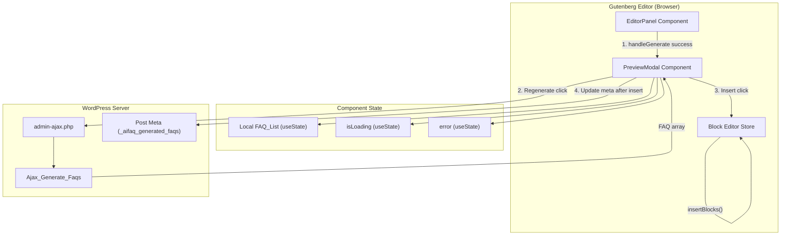
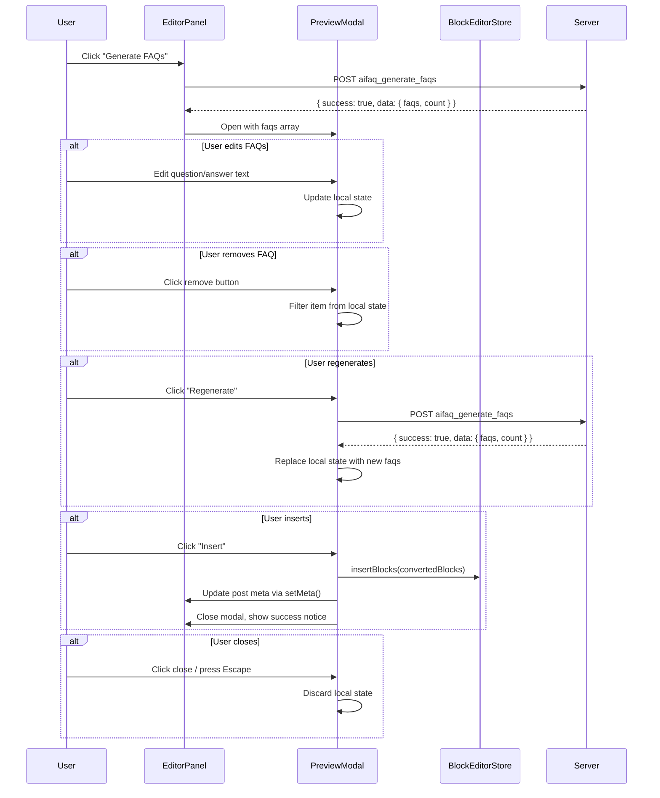

# Design Document: FAQ Preview Modal

## Overview

The FAQ Preview Modal feature introduces an interactive modal dialog that opens after successful FAQ generation, replacing the current static "X FAQs generated" label. The modal allows content editors to review, edit, remove, and regenerate FAQs before inserting them as WordPress blocks into the post content.

The feature adds one primary component:
- **Preview_Modal** (`src/editor/PreviewModal.js`) — a React component using the WordPress `Modal` from `@wordpress/components` that manages a local FAQ list state, provides inline editing via `TextControl`/`TextareaControl`, and handles block insertion via `@wordpress/block-editor` dispatch.

The modal integrates with the existing `EditorPanel` component by receiving the generated FAQ data after a successful AJAX response and managing its own lifecycle (open/close/insert).

## Architecture



### Data Flow

1. User clicks "Generate FAQs" in EditorPanel → existing AJAX call fires
2. On success, EditorPanel sets `isModalOpen = true` and passes FAQ array to PreviewModal
3. PreviewModal initializes local state with the FAQ array
4. User can edit questions/answers, remove items, or click "Regenerate" (triggers new AJAX call within modal)
5. User clicks "Insert" → PreviewModal converts FAQ list to blocks → dispatches `insertBlocks()` → updates post meta → closes modal
6. User clicks close/Escape → modal closes, local state discarded, no external changes

### Component Communication



## Components and Interfaces

### File Structure

```
ai-faq-generator/
├── src/
│   └── editor/
│       ├── index.js                  # registerPlugin entry (existing)
│       ├── EditorPanel.js            # Sidebar panel (modified)
│       ├── PreviewModal.js           # NEW — Modal component
│       ├── preview-modal.scss        # NEW — Modal-specific styles
│       └── editor.scss               # Existing panel styles
```

### PreviewModal Component

**File:** `src/editor/PreviewModal.js`

```jsx
// Imports:
import { Modal, Button, TextControl, TextareaControl, Spinner } from '@wordpress/components';
import { useState } from '@wordpress/element';
import { dispatch } from '@wordpress/data';
import { createBlock } from '@wordpress/blocks';

// Props interface:
// {
//   faqs: Array<{ question: string, answer: string }>,  // Initial FAQ data
//   postId: number,                                      // Current post ID
//   onClose: () => void,                                 // Close callback
//   onInsertSuccess: (faqs: Array) => void,              // Post-insert callback (updates meta, shows notice)
// }
```

**Internal State:**
| State Variable | Type | Purpose |
|---|---|---|
| `localFaqs` | `Array<{question, answer}>` | Editable copy of FAQ list |
| `isRegenerating` | `boolean` | Loading state during regeneration |
| `error` | `string\|null` | Inline error message |

**Key Methods:**

| Method | Behavior |
|---|---|
| `handleQuestionChange(index, value)` | Updates `localFaqs[index].question` |
| `handleAnswerChange(index, value)` | Updates `localFaqs[index].answer` |
| `handleRemove(index)` | Filters item at index from `localFaqs` |
| `handleRegenerate()` | Fires AJAX, replaces `localFaqs` on success |
| `handleInsert()` | Converts `localFaqs` to blocks, dispatches insertion, calls `onInsertSuccess` |

### EditorPanel Modifications

The existing `EditorPanel.js` gains:
- `isModalOpen` state (boolean)
- On successful generation: sets `isModalOpen = true` and stores FAQ data
- Renders `<PreviewModal>` conditionally when `isModalOpen === true`
- Receives `onClose` and `onInsertSuccess` callbacks from PreviewModal

```jsx
// New state in EditorPanel:
const [isModalOpen, setIsModalOpen] = useState(false);
const [generatedFaqs, setGeneratedFaqs] = useState([]);

// In handleGenerate success branch:
setGeneratedFaqs(newFaqs);
setIsModalOpen(true);

// In render:
{isModalOpen && (
    <PreviewModal
        faqs={generatedFaqs}
        postId={postId}
        onClose={() => setIsModalOpen(false)}
        onInsertSuccess={(finalFaqs) => {
            setMeta({ ...meta, _aifaq_generated_faqs: JSON.stringify(finalFaqs) });
            setIsModalOpen(false);
            showNotice('success', `${finalFaqs.length} FAQs inserted`, 5000);
        }}
    />
)}
```

### Block Conversion Logic

Located within `PreviewModal.handleInsert()`:

```jsx
import { createBlock } from '@wordpress/blocks';

function faqsToBlocks(faqs) {
    const blocks = [];
    for (const faq of faqs) {
        blocks.push(
            createBlock('core/heading', { level: 3, content: faq.question })
        );
        blocks.push(
            createBlock('core/paragraph', { content: faq.answer })
        );
    }
    return blocks;
}

// Insertion:
const blocks = faqsToBlocks(localFaqs);
dispatch('core/block-editor').insertBlocks(blocks);
```

### AJAX Reuse for Regeneration

The regeneration flow reuses the same AJAX endpoint (`aifaq_generate_faqs`) with identical parameters. The `handleRegenerate` method in PreviewModal mirrors the existing `handleGenerate` pattern from EditorPanel:

```jsx
const handleRegenerate = async () => {
    setIsRegenerating(true);
    setError(null);

    const body = new URLSearchParams();
    body.append('action', 'aifaq_generate_faqs');
    body.append('_ajax_nonce', aifaqEditor.nonce);
    body.append('post_id', postId);

    const controller = new AbortController();
    const timeoutId = setTimeout(() => controller.abort(), 30000);

    try {
        const response = await fetch(aifaqEditor.ajaxurl, {
            method: 'POST',
            body,
            credentials: 'same-origin',
            signal: controller.signal,
        });
        clearTimeout(timeoutId);
        const result = await response.json();

        if (result.success) {
            setLocalFaqs(result.data.faqs);
        } else {
            setError(result.data?.message || 'Regeneration failed.');
        }
    } catch (err) {
        clearTimeout(timeoutId);
        setError('Could not reach the server. Please try again.');
    } finally {
        setIsRegenerating(false);
    }
};
```

### WordPress Package Dependencies

| Package | Usage |
|---|---|
| `@wordpress/components` | Modal, Button, TextControl, TextareaControl, Spinner |
| `@wordpress/element` | useState |
| `@wordpress/data` | dispatch (core/block-editor, core/notices) |
| `@wordpress/blocks` | createBlock |
| `@wordpress/block-editor` | Store access via dispatch('core/block-editor') |

No new npm dependencies are required — all packages are provided by WordPress and declared as externals by `@wordpress/scripts`.

## Data Models

### FAQ_Item (Local State)

```typescript
interface FaqItem {
    question: string;  // Editable question text
    answer: string;    // Editable answer text
}
```

### PreviewModal Props

```typescript
interface PreviewModalProps {
    faqs: FaqItem[];                        // Initial FAQ data from generation
    postId: number;                         // Current post ID for regeneration
    onClose: () => void;                    // Called when modal closes without insert
    onInsertSuccess: (faqs: FaqItem[]) => void;  // Called after successful block insertion
}
```

### Block Conversion Output

Each `FaqItem` produces exactly 2 blocks:

| Block Type | Attributes | Source |
|---|---|---|
| `core/heading` | `{ level: 3, content: faq.question }` | FAQ question |
| `core/paragraph` | `{ content: faq.answer }` | FAQ answer |

Total blocks inserted = `localFaqs.length * 2`

### Post Meta Update (on Insert)

After successful block insertion, the `_aifaq_generated_faqs` meta is overwritten with the final edited FAQ list:

```json
[
  { "question": "Edited question?", "answer": "Edited answer." },
  { "question": "Another Q?", "answer": "Another A." }
]
```

This ensures the stored meta reflects what was actually inserted into the post.

## Correctness Properties

*A property is a characteristic or behavior that should hold true across all valid executions of a system—essentially, a formal statement about what the system should do. Properties serve as the bridge between human-readable specifications and machine-verifiable correctness guarantees.*

### Property 1: FAQ list rendering invariant

*For any* non-empty array of FAQ items, the PreviewModal SHALL render exactly one labeled question field and one labeled answer field per item, display a 1-based index for each item matching its position in the array, preserve the original array order in the rendered output, and display a count equal to the array length.

**Validates: Requirements 1.3, 2.1, 2.2, 2.3**

### Property 2: Controlled input state synchronization

*For any* FAQ list and any text modification to a question or answer field at a valid index, the local FAQ list state SHALL immediately reflect the new value at that index while all other items remain unchanged.

**Validates: Requirements 3.3, 3.4**

### Property 3: Removal reduces list and re-indexes

*For any* FAQ list of length N > 0 and any valid index i (0 ≤ i < N), removing the item at index i SHALL produce a list of length N-1, the removed item SHALL not appear in the resulting list, and the remaining items SHALL be numbered sequentially from 1 to N-1.

**Validates: Requirements 4.2, 4.3, 2.4**

### Property 4: Block conversion correctness

*For any* non-empty FAQ list, the block conversion function SHALL produce exactly 2 × N blocks where N is the list length, with blocks at positions (2i, 2i+1) being a heading block (level 3) containing the question at index i followed by a paragraph block containing the answer at index i, preserving FAQ list order.

**Validates: Requirements 6.2, 6.3**

### Property 5: Local state isolation

*For any* sequence of edits (question changes, answer changes, removals) performed within the PreviewModal, no post meta or post content SHALL be modified until the user explicitly clicks "Insert". Closing the modal after any edit sequence SHALL result in zero external state changes.

**Validates: Requirements 7.1, 7.2, 1.4**

### Property 6: Insertion uses final edited state

*For any* FAQ list that has been modified through edits and removals, when the user clicks "Insert", the generated blocks SHALL correspond exactly to the current local FAQ list state (not the original unedited state), with each remaining item's current question and answer text used for block content.

**Validates: Requirements 7.3**

### Property 7: Post meta persistence after insertion

*For any* FAQ list state at the time of insertion, after successful block insertion the `_aifaq_generated_faqs` post meta SHALL be overwritten with a JSON string that, when parsed, produces an array identical to the FAQ list that was used for block generation.

**Validates: Requirements 7.4**

### Property 8: Accessible names for all interactive elements

*For any* FAQ list of length N, every interactive element within the PreviewModal SHALL have an accessible name: each remove button SHALL have an aria-label containing its 1-based FAQ index, each question input SHALL have a label, each answer textarea SHALL have a label, and the Regenerate and Insert buttons SHALL have discernible text content.

**Validates: Requirements 4.1, 8.7**

## Error Handling

### Error Matrix

| Context | Condition | Behavior |
|---|---|---|
| Initial generation | AJAX success | Open modal with FAQ data |
| Initial generation | AJAX error with message | Show error notice (8s), modal stays closed |
| Initial generation | Network error / timeout | Show "Could not reach the server" notice (8s), modal stays closed |
| Regeneration | AJAX success | Replace local FAQ list, clear error |
| Regeneration | AJAX error with message | Show inline error in modal, retain existing list |
| Regeneration | Network error / timeout (30s) | Show inline timeout error, retain existing list |
| Block insertion | Success | Close modal, show success notice (5s), update meta |
| Block insertion | Failure (exception) | Keep modal open, show inline error, list unchanged |
| Meta update | Failure after insertion | Show inline warning, blocks remain in content |

### Error Display Strategy

- **EditorPanel errors** (initial generation failures): Use `dispatch('core/notices').createNotice()` with snackbar type, auto-dismiss after 8 seconds
- **PreviewModal errors** (regeneration/insertion failures): Inline error message rendered within the modal body using a styled `<p>` element with WordPress error color (`--wp-components-color-accent-red` or similar admin token)
- **Success notices**: Snackbar via `dispatch('core/notices')`, auto-dismiss after 5 seconds

### Error Recovery

- All errors restore interactive state (buttons enabled, inputs editable)
- Regeneration errors preserve the existing FAQ list so the user doesn't lose edits
- Block insertion errors keep the modal open so the user can retry
- No partial state is persisted — meta is only updated after confirmed successful insertion

## Testing Strategy

### Unit Tests (JavaScript — Jest + React Testing Library)

Tests use the existing Jest configuration with `@wordpress/scripts` and manual mocks for WordPress packages.

**EditorPanel tests:**
- Successful generation opens the modal with FAQ data
- Error response does not open the modal
- Network timeout does not open the modal

**PreviewModal tests:**
- Renders correct title, FAQ count, and all FAQ items
- Edit question/answer updates local state
- Remove button removes item and re-indexes
- Empty state shown when all items removed
- Insert button disabled when list is empty
- Regenerate triggers AJAX and replaces list on success
- Regenerate error shows inline message, retains list
- Insert converts FAQs to blocks and calls onInsertSuccess
- Close button calls onClose without side effects
- Loading state during regeneration disables inputs and buttons
- Empty field validation indicator shown for cleared fields

### Property-Based Tests (JavaScript — fast-check)

The project will use [fast-check](https://github.com/dubzzz/fast-check) for JavaScript property-based testing. Each property test runs a minimum of 100 iterations.

**New dev dependency:** `fast-check` (added to package.json devDependencies)

| Property | Test File | Tag |
|---|---|---|
| Property 1: FAQ list rendering | `src/editor/__tests__/PreviewModal.property.test.js` | Feature: faq-preview-modal, Property 1: FAQ list rendering invariant |
| Property 2: Input synchronization | `src/editor/__tests__/PreviewModal.property.test.js` | Feature: faq-preview-modal, Property 2: Controlled input state synchronization |
| Property 3: Removal and re-indexing | `src/editor/__tests__/PreviewModal.property.test.js` | Feature: faq-preview-modal, Property 3: Removal reduces list and re-indexes |
| Property 4: Block conversion | `src/editor/__tests__/PreviewModal.property.test.js` | Feature: faq-preview-modal, Property 4: Block conversion correctness |
| Property 5: Local state isolation | `src/editor/__tests__/PreviewModal.property.test.js` | Feature: faq-preview-modal, Property 5: Local state isolation |
| Property 6: Insertion uses edited state | `src/editor/__tests__/PreviewModal.property.test.js` | Feature: faq-preview-modal, Property 6: Insertion uses final edited state |
| Property 7: Meta persistence | `src/editor/__tests__/PreviewModal.property.test.js` | Feature: faq-preview-modal, Property 7: Post meta persistence after insertion |
| Property 8: Accessible names | `src/editor/__tests__/PreviewModal.property.test.js` | Feature: faq-preview-modal, Property 8: Accessible names for all interactive elements |

**Configuration:** Each property test uses `fc.assert(fc.property(...), { numRuns: 100 })`.

**Generators:**
- `faqItemArb`: Generates `{ question: fc.string({ minLength: 1 }), answer: fc.string({ minLength: 1 }) }`
- `faqListArb`: `fc.array(faqItemArb, { minLength: 1, maxLength: 20 })`
- `validIndexArb(list)`: `fc.integer({ min: 0, max: list.length - 1 })`

### Mock Requirements

The existing `@wordpress/components` mock needs to be extended with:
- `Modal` — renders children in a container with close button
- `TextControl` — renders an input with label and onChange
- `TextareaControl` — renders a textarea with label and onChange

A new mock for `@wordpress/blocks` is needed:
- `createBlock(name, attributes)` — returns `{ name, attributes }`

A new mock for `@wordpress/block-editor` store dispatch is needed:
- `dispatch('core/block-editor').insertBlocks(blocks)` — jest.fn()

### Integration Tests

- End-to-end flow: generate → preview → edit → insert → verify blocks in editor
- Regeneration within modal with real AJAX endpoint (wp-env)
- Keyboard navigation and focus trapping verification
