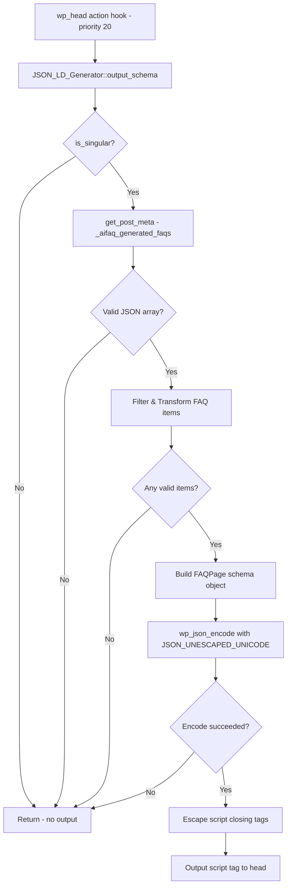

# Design Document: FAQPage JSON-LD Generator

## Overview

This feature adds a `JSON_LD_Generator` service class to the AI FAQ Generator plugin that automatically outputs FAQPage structured data (JSON-LD) in the document `<head>` for any singular post containing generated FAQs. The component hooks into `wp_head` at priority 20, reads the `_aifaq_generated_faqs` post meta, transforms the FAQ data into a schema.org-compliant FAQPage object, and outputs it inside a `<script type="application/ld+json">` tag.

The generator is a pure data transformation pipeline: read meta → validate → transform → encode → output. It follows the same service-class pattern used by `Faq_Parser` and `Faq_Generator` in the existing codebase.

## Architecture



The architecture is intentionally simple — a single service class with focused responsibilities, no external dependencies beyond WordPress core functions, and straightforward integration through the existing `Loader` class.

## Components and Interfaces

### JSON_LD_Generator Class

**File:** `includes/services/class-json-ld-generator.php`  
**Namespace:** `WPBits\AiFaqGenerator\Includes\Services`

```php
class JSON_LD_Generator
{
    /**
     * Register the wp_head hook.
     */
    public function init(): void;

    /**
     * Output FAQPage JSON-LD schema in the document head.
     * Hooked to wp_head at priority 20.
     */
    public function output_schema(): void;

    /**
     * Build the FAQPage schema array from raw FAQ meta data.
     *
     * @param string $raw_meta The raw meta value from get_post_meta.
     * @return array|null The FAQPage schema array, or null if no valid items.
     */
    private function build_schema(string $raw_meta): ?array;

    /**
     * Decode and validate the raw meta string into FAQ items.
     *
     * @param string $raw_meta Raw JSON string from post meta.
     * @return array<int, array{question: string, answer: string}> Valid FAQ items.
     */
    private function parse_faq_items(string $raw_meta): array;

    /**
     * Transform a single FAQ item into a schema.org Question object.
     *
     * @param array{question: string, answer: string} $item Validated FAQ item.
     * @return array The Question schema object.
     */
    private function build_question_object(array $item): array;

    /**
     * Prepare question text: decode HTML entities, strip HTML tags.
     *
     * @param string $text Raw question text.
     * @return string Cleaned question text.
     */
    private function prepare_question_text(string $text): string;

    /**
     * Prepare answer text: decode HTML entities, preserve HTML markup.
     *
     * @param string $text Raw answer text.
     * @return string Processed answer text.
     */
    private function prepare_answer_text(string $text): string;

    /**
     * Escape closing script tags in JSON output to prevent XSS.
     *
     * @param string $json Encoded JSON string.
     * @return string Safe JSON string for embedding in script tag.
     */
    private function escape_script_tags(string $json): string;
}
```

### Integration with Loader

The `Loader` class will be updated to instantiate and initialize the `JSON_LD_Generator`:

```php
// In Loader::init(), after existing initializations:
$json_ld_generator = new Services\JSON_LD_Generator();
$json_ld_generator->init();
```

The class map in `Loader::__construct()` will register the new file:

```php
'WPBits\\AiFaqGenerator\\Includes\\Services\\JSON_LD_Generator' => AFG_PLUGIN_PATH . 'includes/services/class-json-ld-generator.php',
```

### Public API for Remove Action

The `init()` method registers the hook with `[$this, 'output_schema']` — a publicly accessible callable that other plugins can reference via:

```php
remove_action('wp_head', [$json_ld_generator_instance, 'output_schema'], 20);
```

To enable this, the Loader stores the instance as a property or the class uses a singleton-like static accessor. The preferred approach (matching the existing pattern in the plugin) is to store a reference accessible via a filter:

```php
// In init():
add_action('wp_head', [$this, 'output_schema'], 20);
```

Since the Loader instantiates it inline, the instance is accessible through `remove_action` if another plugin has a reference. The callback is a public method on a concrete class — not a closure — satisfying requirement 5.4.

## Data Models

### Input: FAQ Meta Structure

The `_aifaq_generated_faqs` post meta stores a JSON-encoded string:

```json
[
    {"question": "What is WordPress?", "answer": "WordPress is a CMS."},
    {"question": "Is it free?", "answer": "Yes, WordPress is open-source."}
]
```

**Constraints:**
- Maximum 25 FAQ items processed (per requirement 1.1)
- Each item must have `question` and `answer` string keys
- Both values must be non-empty after trimming whitespace

### Output: FAQPage JSON-LD Schema

```json
{
    "@context": "https://schema.org",
    "@type": "FAQPage",
    "mainEntity": [
        {
            "@type": "Question",
            "name": "What is WordPress?",
            "acceptedAnswer": {
                "@type": "Answer",
                "text": "WordPress is a CMS."
            }
        }
    ]
}
```

### Transformation Rules

| Input Field | Output Field | Transformation |
|---|---|---|
| `item.question` | `Question.name` | Decode HTML entities → Strip HTML tags → Trim |
| `item.answer` | `Answer.text` | Decode HTML entities → Preserve HTML markup |

### Validation Rules

An FAQ item is **valid** if:
1. It is an array/object
2. It has a `question` key with a string value
3. It has an `answer` key with a string value
4. `trim(question)` is non-empty
5. `trim(answer)` is non-empty

## Correctness Properties

*A property is a characteristic or behavior that should hold true across all valid executions of a system — essentially, a formal statement about what the system should do. Properties serve as the bridge between human-readable specifications and machine-verifiable correctness guarantees.*

### Property 1: Schema Structure Invariant

*For any* valid FAQ meta array containing at least one valid FAQ item (with non-empty question and answer), the generated JSON-LD output SHALL contain a root object with `@context` equal to `"https://schema.org"`, `@type` equal to `"FAQPage"`, and a `mainEntity` array where each element has `@type` equal to `"Question"`, a `name` string, and an `acceptedAnswer` object with `@type` equal to `"Answer"` and a `text` string.

**Validates: Requirements 1.1, 2.1, 2.2, 2.3, 2.4, 2.5**

### Property 2: Invalid Item Filtering

*For any* FAQ meta array containing a mix of valid and invalid items (missing keys, empty strings, whitespace-only values), the `mainEntity` array SHALL contain exactly the valid items — its length equals the count of items where both `trim(question)` and `trim(answer)` are non-empty, and no invalid item appears in the output.

**Validates: Requirements 2.6, 3.1, 3.3, 3.4**

### Property 3: Order Preservation

*For any* FAQ meta array, the Question objects in the `mainEntity` array SHALL appear in the same relative order as the corresponding valid items in the input array.

**Validates: Requirements 3.2**

### Property 4: Invalid Input Produces No Output

*For any* string that is not a valid JSON-encoded array of objects (including malformed JSON, non-array JSON values, arrays of non-objects, and empty/whitespace strings), the generator SHALL produce no script tag output.

**Validates: Requirements 1.2, 1.3**

### Property 5: Script Tag Escaping

*For any* FAQ content containing case-insensitive occurrences of `</script` (in any combination of upper/lower case), the final output string SHALL NOT contain a literal `</script` sequence that could terminate the script element.

**Validates: Requirements 4.2**

### Property 6: Unicode Preservation

*For any* FAQ content containing Unicode characters (non-ASCII), those characters SHALL appear unescaped (not as `\uXXXX` sequences) in the JSON-LD output.

**Validates: Requirements 4.1**

### Property 7: JSON Validity with Special Characters

*For any* FAQ content containing double quotes, backslashes, or control characters (U+0000 through U+001F), the JSON content within the script tag (after un-escaping `<\/script`) SHALL be valid JSON per RFC 8259.

**Validates: Requirements 6.2**

### Property 8: HTML Entity Decoding

*For any* FAQ text containing HTML entities (named like `&amp;`, numeric like `&#60;`, or hexadecimal like `&#x3C;`), the JSON-LD output SHALL contain the decoded Unicode character equivalents rather than the raw entity strings.

**Validates: Requirements 6.1**

### Property 9: HTML Handling in Questions and Answers

*For any* FAQ item where the question contains HTML tags and the answer contains HTML markup: the `name` field of the Question object SHALL contain no HTML tags (all stripped), while the `text` field of the Answer object SHALL preserve the HTML markup from the answer.

**Validates: Requirements 6.3, 6.4**

## Error Handling

| Scenario | Behavior |
|---|---|
| `is_singular()` returns false | Early return, no output |
| `get_post_meta()` returns empty string or false | Early return, no output |
| JSON decode fails (`json_decode` returns null or non-array) | Early return, no output |
| All FAQ items invalid after filtering | Early return, no output |
| `wp_json_encode()` returns false | Early return, no output — no partial content |
| FAQ meta contains > 25 items | Process only the first 25 items |

The generator follows a "fail silently" pattern — it never throws exceptions and never outputs partial or malformed content. Every failure path results in zero output, which is safe for SEO (absence of structured data is benign; malformed structured data can cause penalties).

## Testing Strategy

### Property-Based Tests (PHPUnit with DataProviders)

The project uses PHPUnit 11 with `DataProvider`-based property testing (generating 100+ random inputs per property). This matches the existing pattern in `FaqParserValidParsingPropertyTest.php`.

**Library:** PHPUnit 11 with randomized `DataProvider` arrays (100+ iterations per property)  
**Tag format:** `Feature: faqpage-jsonld-generator, Property {number}: {property_text}`

Each correctness property maps to one property-based test class:

1. `JsonLdSchemaStructurePropertyTest` — Property 1
2. `JsonLdFilteringPropertyTest` — Property 2
3. `JsonLdOrderPropertyTest` — Property 3
4. `JsonLdInvalidInputPropertyTest` — Property 4
5. `JsonLdScriptEscapingPropertyTest` — Property 5
6. `JsonLdUnicodePropertyTest` — Property 6
7. `JsonLdJsonValidityPropertyTest` — Property 7
8. `JsonLdEntityDecodingPropertyTest` — Property 8
9. `JsonLdHtmlHandlingPropertyTest` — Property 9

### Unit Tests (Example-Based)

Specific scenarios and edge cases that complement property tests:

- **Hook registration:** Verify `add_action('wp_head', ..., 20)` is called during init
- **Non-singular pages:** Verify no output on archives, search, 404, etc.
- **wp_json_encode failure:** Mock to return false, verify no output
- **Callable accessibility:** Verify callback is a public method (not closure)
- **Maximum 25 items:** Verify arrays > 25 items are truncated
- **Empty meta values:** Test `''`, `'[]'`, `false` — no output

### Test Environment

Tests use the existing stub-based approach in `tests/bootstrap.php`. New WordPress function stubs needed:

- `is_singular()` — returns configurable boolean
- `get_post_meta()` — returns configurable value

These will be added to the bootstrap file following the existing pattern (`global $afg_test_*` variables controlling stub behavior).
