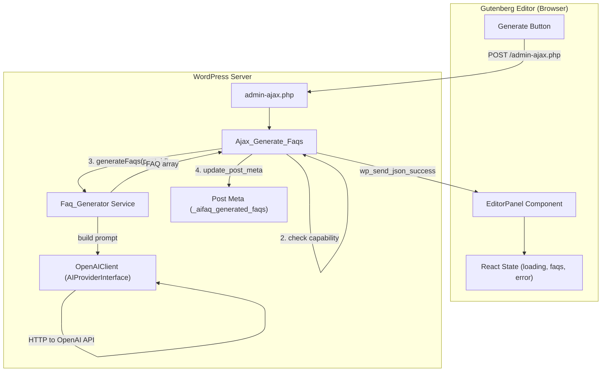

# Design Document: Generate Button

## Overview

The Generate Button feature adds an AI-powered FAQ generation panel to the WordPress Gutenberg editor sidebar. It connects the existing `Faq_Generator` service to the editor UI through a new AJAX handler, allowing content editors to generate and persist FAQ data directly from the post editing screen.

The feature introduces three new components:
1. **PHP AJAX Handler** (`Ajax_Generate_Faqs`) — receives requests from the editor, validates security, invokes `Faq_Generator`, stores results as post meta, and returns the response.
2. **React Editor Panel** — a `PluginDocumentSettingPanel` component that renders the "Generate FAQs" button, manages loading state, and displays results.
3. **Post Meta Registration** — registers the `_aifaq_generated_faqs` meta key on the `init` hook with sanitization and auth callbacks.

The design leverages existing patterns: the `Loader` class for initialization, the `Admin` class for hook registration, and the `@wordpress/scripts` build pipeline for the editor bundle.

## Architecture



### Data Flow

1. Editor loads → script enqueued with localized `aifaqEditor` object (ajaxurl, nonce, postId)
2. Panel mounts → reads existing `_aifaq_generated_faqs` meta via REST API (`useEntityProp`)
3. User clicks "Generate FAQs" → AJAX POST to `wp_ajax_aifaq_generate_faqs`
4. Handler verifies nonce → checks `edit_post` capability → calls `Faq_Generator::generateFaqs()`
5. Handler stores result in post meta → returns JSON success with faqs array and count
6. Panel receives response → updates local state → displays success notice

## Components and Interfaces

### New Files

```
ai-faq-generator/
├── includes/
│   └── class-ajax-generate-faqs.php    # AJAX handler class
├── src/
│   └── editor/
│       ├── index.js                     # registerPlugin entry
│       ├── EditorPanel.js               # PluginDocumentSettingPanel component
│       └── editor.scss                  # Panel-specific styles (optional)
```

### PHP: `Ajax_Generate_Faqs` Class

**Namespace:** `WPBits\AiFaqGenerator\Includes`  
**File:** `includes/class-ajax-generate-faqs.php`

```php
<?php
declare(strict_types=1);

namespace WPBits\AiFaqGenerator\Includes;

use WPBits\AiFaqGenerator\Includes\Services\Faq_Generator;
use WPBits\AiFaqGenerator\Includes\Services\Prompt_Builder;

class Ajax_Generate_Faqs
{
    public function init(): void;
    public function handle(): void;
}
```

**Responsibilities:**
- Registers `wp_ajax_aifaq_generate_faqs` action hook in `init()`
- `handle()` performs: nonce verification → capability check → post_id validation → FAQ generation → meta storage → JSON response
- Instantiates `Faq_Generator` with `OpenAIClient` and `Prompt_Builder` dependencies
- Catches `\InvalidArgumentException` (400) and `\RuntimeException` (500) from the service

### PHP: Meta Registration

Meta registration will be added to the `Loader::init()` method via a new `register_meta()` call on the `init` hook.

```php
add_action('init', [$this, 'register_faq_meta']);
```

**Meta configuration:**
- `object_type`: `'post'`
- `meta_key`: `'_aifaq_generated_faqs'`
- `type`: `'string'`
- `single`: `true`
- `show_in_rest`: `true`
- `sanitize_callback`: validates JSON structure (array of `{question, answer}` objects)
- `auth_callback`: checks `edit_post` capability

### PHP: Script Enqueueing

The `Admin` class gains a new method hooked to `enqueue_block_editor_assets`:

```php
public function enqueue_editor_assets(): void;
```

**Behavior:**
- Checks `build/index.asset.php` exists; bails silently if not
- Registers script handle `aifaq-editor` with dependencies from asset file
- Localizes `aifaqEditor` object with `ajaxurl`, `nonce`, `postId`

### JavaScript: Editor Panel Component

**Entry:** `src/editor/index.js` — calls `registerPlugin` from `@wordpress/plugins`

**Component:** `src/editor/EditorPanel.js`

```jsx
// Uses:
// - PluginDocumentSettingPanel from @wordpress/editor
// - Button, Spinner from @wordpress/components
// - useEntityProp from @wordpress/core-data
// - useSelect from @wordpress/data
// - useState from @wordpress/element
// - dispatch('core/notices') for notices
```

**Props/State:**
- `isLoading` (boolean) — controls button disabled/busy state and spinner visibility
- `faqs` (array|null) — parsed FAQ data from meta
- `error` (string|null) — error message for display

### Integration with Existing Classes

| Existing Class | Change |
|---|---|
| `Loader` | Add `Ajax_Generate_Faqs` to autoload map; add `register_faq_meta` on `init` hook |
| `Admin` | Add `enqueue_block_editor_assets` hook calling `enqueue_editor_assets()` |
| `webpack.config.js` | No change needed — `src/index.js` already the entry point; editor panel registers via `src/index.js` imports |

### Webpack Entry Point Strategy

The editor panel code will be imported from `src/index.js` (the existing entry point that builds to `build/index.js`). This keeps the webpack config unchanged:

```js
// src/index.js
import './editor';  // registers the plugin sidebar panel
```

This approach works because:
- The `index` entry already exists and builds to `build/index.js`
- The `enqueue_block_editor_assets` hook ensures it only loads in the editor context
- No new webpack entry point is needed

## Data Models

### Post Meta: `_aifaq_generated_faqs`

**Storage format:** JSON-encoded string

```json
[
  { "question": "What is X?", "answer": "X is..." },
  { "question": "How does Y work?", "answer": "Y works by..." }
]
```

**Schema:**
| Field | Type | Constraints |
|---|---|---|
| `question` | string | Non-empty, trimmed |
| `answer` | string | Non-empty, trimmed |

**WordPress registration:**
```php
register_meta('post', '_aifaq_generated_faqs', [
    'type'              => 'string',
    'single'            => true,
    'show_in_rest'      => true,
    'sanitize_callback' => [$this, 'sanitize_faq_meta'],
    'auth_callback'     => function ($allowed, $meta_key, $post_id) {
        return current_user_can('edit_post', $post_id);
    },
]);
```

### Localized Script Object: `aifaqEditor`

```typescript
interface AifaqEditor {
    ajaxurl: string;  // WordPress admin-ajax.php URL
    nonce: string;    // wp_create_nonce('aifaq_generate_faqs')
    postId: number;   // Current post ID from get_the_ID()
}
```

### AJAX Request/Response

**Request (POST to admin-ajax.php):**
```
action=aifaq_generate_faqs
_ajax_nonce=<nonce_value>
post_id=<integer>
```

**Success Response:**
```json
{
    "success": true,
    "data": {
        "faqs": [
            { "question": "...", "answer": "..." }
        ],
        "count": 3
    }
}
```

**Error Response:**
```json
{
    "success": false,
    "data": {
        "message": "Error description"
    }
}
```

## Correctness Properties

*A property is a characteristic or behavior that should hold true across all valid executions of a system—essentially, a formal statement about what the system should do. Properties serve as the bridge between human-readable specifications and machine-verifiable correctness guarantees.*

### Property 1: Invalid post_id rejection

*For any* value that is not a positive integer (including zero, negative integers, non-numeric strings, null, and empty strings), when passed as the `post_id` parameter to the AJAX handler, the handler SHALL return a JSON error response with HTTP status 400.

**Validates: Requirements 4.4, 5.5**

### Property 2: Successful response structure invariant

*For any* valid FAQ array returned by the `Faq_Generator` service (an array of objects each containing non-empty "question" and "answer" strings), the AJAX handler's success response SHALL contain a `faqs` key holding the exact array and a `count` key whose integer value equals the length of the `faqs` array.

**Validates: Requirements 5.2**

### Property 3: FAQ meta sanitization round-trip

*For any* valid JSON string representing an array of objects where each object contains a "question" key and an "answer" key with non-empty string values, the sanitize callback SHALL return the value unchanged. *For any* string that is not valid JSON, or valid JSON that does not represent an array of `{question, answer}` objects, the sanitize callback SHALL return an empty string.

**Validates: Requirements 6.2**

## Error Handling

### PHP AJAX Handler Error Matrix

| Condition | HTTP Status | Error Message |
|---|---|---|
| Nonce verification fails | 403 | "Security check failed." |
| Missing/invalid post_id | 400 | "Post ID is required and must be a positive integer." |
| User lacks `edit_post` capability | 403 | "You do not have permission to edit this post." |
| `Faq_Generator` throws `InvalidArgumentException` | 400 | Exception message (e.g., "Invalid post ID: -1") |
| `Faq_Generator` throws `RuntimeException` | 500 | Exception message (e.g., "Post not found: 999") |
| `update_post_meta()` returns false | 500 | "FAQ data could not be saved." |

### JavaScript Error Handling

| Condition | User Feedback |
|---|---|
| AJAX success response | Success notice: "{count} FAQs generated" (auto-dismiss 5s) |
| AJAX error with `data.message` | Error notice with server message (auto-dismiss 8s) |
| AJAX error without `data.message` | Generic error: "FAQ generation failed." (auto-dismiss 8s) |
| Network error / timeout (30s) | Error notice: "Could not reach the server. Please try again." (auto-dismiss 8s) |

### Error Recovery

- All errors restore the button to its default enabled state
- No partial state is persisted on failure — meta is only updated on full success
- The user can retry immediately after any error

## Testing Strategy

### Unit Tests (PHP — PHPUnit)

- **Ajax_Generate_Faqs::handle()** — test each validation step (nonce, capability, post_id) returns correct error response
- **Ajax_Generate_Faqs::handle()** — test successful generation stores meta and returns correct response
- **Ajax_Generate_Faqs::handle()** — test exception handling for RuntimeException and InvalidArgumentException
- **sanitize_faq_meta()** — test valid JSON passes through, invalid JSON returns empty string
- **enqueue_editor_assets()** — test script registration with/without asset file

### Unit Tests (JavaScript — Jest/RTL)

- **EditorPanel** — renders panel with correct title and button text
- **EditorPanel** — button click triggers AJAX with correct parameters
- **EditorPanel** — loading state shows spinner, disables button, changes text
- **EditorPanel** — success response updates FAQ count display and shows notice
- **EditorPanel** — error response shows error notice
- **EditorPanel** — network timeout shows generic error notice
- **EditorPanel** — existing meta displays FAQ count on load

### Property-Based Tests (PHP — PHPUnit with data providers)

The project uses PHPUnit for PHP testing. Property-based tests will use PHPUnit data providers with randomized input generation to achieve 100+ iterations per property.

- **Property 1**: Generate random invalid post_id values and verify 400 response
  - Tag: `Feature: generate-button, Property 1: Invalid post_id rejection`
- **Property 2**: Generate random FAQ arrays and verify response structure
  - Tag: `Feature: generate-button, Property 2: Successful response structure invariant`
- **Property 3**: Generate random JSON strings (valid and invalid FAQ structures) and verify sanitize callback behavior
  - Tag: `Feature: generate-button, Property 3: FAQ meta sanitization round-trip`

**Configuration:** Minimum 100 iterations per property test via data provider arrays or loop-based generation.

### Integration Tests

- End-to-end AJAX request with real WordPress environment (wp-env)
- Verify meta is persisted and readable via REST API after generation

