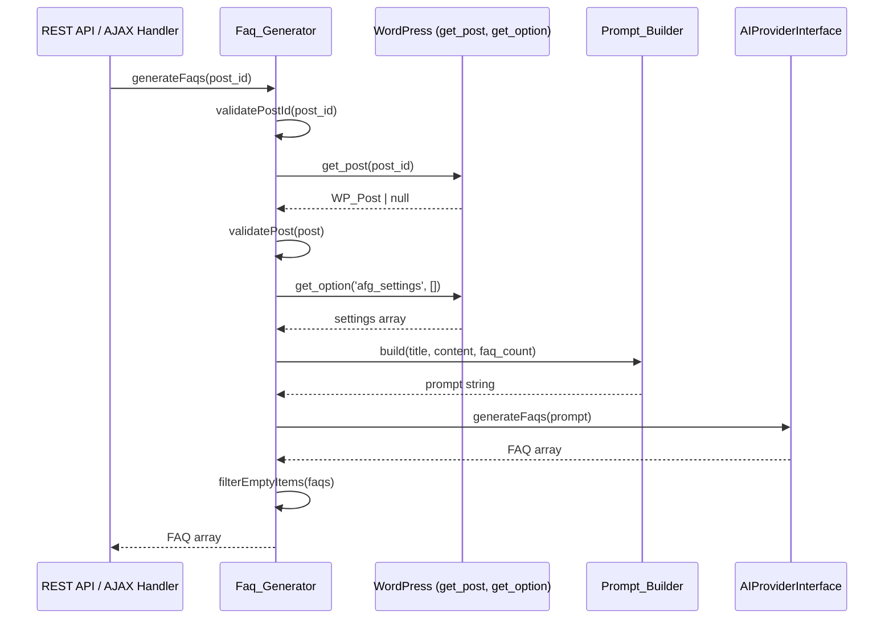
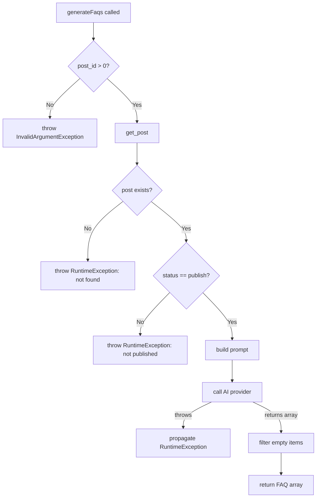

# Design Document: FAQ Generator Service

## Overview

The Faq_Generator service is the orchestration layer that coordinates the full FAQ generation pipeline within the AI FAQ Generator plugin. It accepts a WordPress post ID, retrieves the post data, delegates prompt construction to the Prompt_Builder, invokes the AI provider via the AIProviderInterface, and returns the structured FAQ array to the caller.

The service follows the dependency injection pattern established by the plugin architecture — receiving both the AIProviderInterface and Prompt_Builder through its constructor. This makes the service fully testable with mocks and allows swapping AI providers without modifying the orchestration logic.

**Key design decisions:**
- The service does NOT perform any response parsing or transformation — that responsibility belongs to the AI provider (which internally uses Faq_Parser).
- Post validation (existence, publish status) happens early to fail fast before expensive AI calls.
- The service reads `afg_settings` for the `faq_count` setting, keeping configuration access centralized.
- Exception propagation is explicit: AI provider exceptions bubble up unchanged, while post-related errors throw domain-specific exceptions.

## Architecture



The service sits between the transport layer (REST/AJAX) and the infrastructure layer (AI provider, WordPress). It contains only orchestration logic — no HTTP handling, no JSON parsing, no AI communication details.

## Components and Interfaces

### Faq_Generator Class

**Namespace:** `WPBits\AiFaqGenerator\Includes\Services`  
**File:** `includes/services/class-faq-generator.php`

```php
<?php
declare(strict_types=1);

namespace WPBits\AiFaqGenerator\Includes\Services;

use WPBits\AiFaqGenerator\Includes\Interfaces\AIProviderInterface;

class Faq_Generator
{
    private AIProviderInterface $ai_provider;
    private Prompt_Builder $prompt_builder;

    public function __construct(
        AIProviderInterface $ai_provider,
        Prompt_Builder $prompt_builder
    ) {
        $this->ai_provider = $ai_provider;
        $this->prompt_builder = $prompt_builder;
    }

    /**
     * Generate FAQs for a given WordPress post.
     *
     * @param int $post_id The WordPress post ID.
     * @return array<int, array{question: string, answer: string}>
     * @throws \InvalidArgumentException If post_id is zero or negative.
     * @throws \RuntimeException If post not found or not published.
     */
    public function generateFaqs(int $post_id): array;
}
```

### Method Responsibilities

| Method | Responsibility |
|--------|---------------|
| `__construct(AIProviderInterface, Prompt_Builder)` | Store injected dependencies as private properties |
| `generateFaqs(int $post_id): array` | Orchestrate the full pipeline: validate → fetch → build prompt → call AI → filter → return |

### Internal Flow (within generateFaqs)

1. **Validate post ID** — throw `InvalidArgumentException` if `$post_id <= 0`
2. **Fetch post** — call `get_post($post_id)`, throw `RuntimeException` if null
3. **Validate post status** — throw `RuntimeException` if `post_status !== 'publish'`
4. **Read settings** — call `get_option('afg_settings', [])` to get `faq_count`
5. **Build prompt** — call `$this->prompt_builder->build($title, $content, $faq_count)`
6. **Call AI provider** — call `$this->ai_provider->generateFaqs($prompt)` (exceptions propagate)
7. **Filter empty items** — remove any FAQ items with empty/whitespace-only question or answer
8. **Return** — return the filtered, re-indexed FAQ array

### Dependencies (Injected)

| Dependency | Interface/Class | Purpose |
|-----------|----------------|---------|
| `$ai_provider` | `AIProviderInterface` | Sends prompt to AI, returns FAQ array |
| `$prompt_builder` | `Prompt_Builder` | Constructs prompt string from post data |

### Dependencies (WordPress Functions)

| Function | Purpose |
|----------|---------|
| `get_post(int $post_id)` | Retrieve WP_Post object by ID |
| `get_option(string $option, mixed $default)` | Read plugin settings |

## Data Models

### Input

| Parameter | Type | Constraints |
|-----------|------|-------------|
| `$post_id` | `int` | Must be > 0 |

### Internal Data Flow

```
post_id (int > 0)
  → WP_Post { post_title: string, post_content: string, post_status: string }
  → afg_settings['faq_count'] (int|null)
  → prompt (string) via Prompt_Builder::build()
  → FAQ array via AIProviderInterface::generateFaqs()
  → filtered FAQ array (empty items removed)
```

### Output

```php
array<int, array{question: string, answer: string}>
```

A zero-indexed array where each element contains exactly two keys:
- `question` — non-empty, trimmed string
- `answer` — non-empty, trimmed string

### Settings Structure (afg_settings option)

```php
[
    'api_key'     => string,   // AI provider API key
    'model'       => string,   // Model identifier
    'temperature' => float,    // Generation temperature
    'base_url'    => string,   // API base URL
    'faq_count'   => int|null, // Number of FAQs to generate (1-20, null = default 5)
]
```

### Exception Types

| Exception | Condition | Message Pattern |
|-----------|-----------|-----------------|
| `InvalidArgumentException` | `$post_id <= 0` | "Invalid post ID: {post_id}" |
| `RuntimeException` | `get_post()` returns null | "Post not found: {post_id}" |
| `RuntimeException` | Post status ≠ 'publish' | "Post is not published: {post_id}" |
| `RuntimeException` | AI provider failure | Original message from provider (propagated) |

## Correctness Properties

*A property is a characteristic or behavior that should hold true across all valid executions of a system — essentially, a formal statement about what the system should do. Properties serve as the bridge between human-readable specifications and machine-verifiable correctness guarantees.*

### Property 1: Invalid post ID rejection

*For any* integer less than or equal to zero, calling `generateFaqs()` with that value SHALL throw an `InvalidArgumentException` without calling `get_post()` or any other dependency.

**Validates: Requirements 1.4**

### Property 2: Non-existent post throws with ID in message

*For any* positive integer post ID where `get_post()` returns null, calling `generateFaqs()` SHALL throw a `RuntimeException` whose message contains the string representation of that post ID.

**Validates: Requirements 1.3, 5.2**

### Property 3: Non-published post rejection

*For any* post with a `post_status` value other than "publish" (e.g., "draft", "pending", "trash", "private", "future"), calling `generateFaqs()` SHALL throw a `RuntimeException` without invoking the Prompt_Builder or AI provider.

**Validates: Requirements 1.5**

### Property 4: Post data forwarding to Prompt_Builder

*For any* published post with arbitrary title and content strings, the Faq_Generator SHALL pass the exact `post_title` as the first argument and the exact `post_content` as the second argument to `Prompt_Builder::build()`.

**Validates: Requirements 1.2, 2.1**

### Property 5: Settings faq_count forwarding

*For any* non-null `faq_count` value stored in the `afg_settings` option, the Faq_Generator SHALL cast it to an integer and pass that integer as the third argument to `Prompt_Builder::build()`.

**Validates: Requirements 2.2**

### Property 6: Prompt forwarding to AI provider

*For any* prompt string returned by `Prompt_Builder::build()`, the Faq_Generator SHALL pass that exact string to `AIProviderInterface::generateFaqs()` without modification.

**Validates: Requirements 3.1**

### Property 7: AI provider exception propagation

*For any* `RuntimeException` thrown by `AIProviderInterface::generateFaqs()`, the Faq_Generator SHALL propagate that exception to the caller with the original message string unchanged.

**Validates: Requirements 3.4, 5.1**

### Property 8: Valid FAQ passthrough

*For any* FAQ array returned by the AI provider where all items have non-empty, non-whitespace-only question and answer values, the Faq_Generator SHALL return that array unchanged.

**Validates: Requirements 4.1, 4.2**

### Property 9: Empty/whitespace item filtering

*For any* FAQ array containing items where the question or answer is empty or consists only of whitespace characters, the Faq_Generator SHALL exclude those items from the returned array while preserving all valid items in their original order.

**Validates: Requirements 4.4**

## Error Handling

### Error Strategy

The Faq_Generator uses a **fail-fast** approach with explicit exception types:

| Layer | Error Type | Strategy |
|-------|-----------|----------|
| Input validation | `InvalidArgumentException` | Throw immediately before any I/O |
| Post retrieval | `RuntimeException` | Throw if post missing or wrong status |
| AI provider | `RuntimeException` | Propagate unchanged from provider |
| FAQ filtering | None | Silent removal of invalid items (no exception) |

### Error Flow



### Design Rationale

- **No catch blocks around AI provider calls**: The caller (REST/AJAX handler) is responsible for translating exceptions into HTTP responses. The service should not swallow errors.
- **Empty array is not an error**: The AI provider may legitimately return zero results (e.g., content too short to generate FAQs). This is a valid outcome.
- **Filtering is silent**: Items with empty/whitespace values are quietly removed rather than throwing. This handles edge cases in AI responses gracefully without failing the entire request.

## Testing Strategy

### Test Framework

- **PHPUnit 11** with the existing test bootstrap (`tests/bootstrap.php`)
- **WordPress function stubs** already defined in bootstrap (get_post, get_option, etc.)
- **Mock objects** via PHPUnit's `createMock()` for AIProviderInterface and Prompt_Builder
- **PHPUnit property-based testing** via [phpunit/phpunit](https://phpunit.de/) with data providers generating random inputs (100+ iterations per property)

### Property-Based Testing Library

Since the project uses PHPUnit 11 and PHP 8.1+, property tests will use **PHPUnit data providers with random generation** to simulate property-based testing. Each property test will:
- Use a data provider that generates 100+ random inputs
- Tag each test with a comment referencing the design property
- Assert the universal property holds for all generated inputs

### Test File Structure

```
tests/unit/
├── FaqGeneratorTest.php              # Example-based unit tests
├── FaqGeneratorValidationPropertyTest.php   # Properties 1-3 (input validation)
├── FaqGeneratorForwardingPropertyTest.php   # Properties 4-6 (data forwarding)
├── FaqGeneratorErrorPropertyTest.php        # Property 7 (exception propagation)
├── FaqGeneratorOutputPropertyTest.php       # Properties 8-9 (output correctness)
```

### Unit Tests (Example-Based)

| Test Case | Validates |
|-----------|-----------|
| Constructor accepts AIProviderInterface and Prompt_Builder | Req 6.1, 6.2, 6.3 |
| Null faq_count passes null to Prompt_Builder | Req 2.3 |
| Missing afg_settings option uses empty array default | Req 2.4 |
| Empty title + empty content proceeds without exception | Req 5.3 |
| Non-empty title + empty content proceeds | Req 5.4 |
| Empty title + non-empty content proceeds | Req 5.4 |
| Empty AI response returns empty array | Req 4.3, 5.5 |

### Property Tests

| Property Test | Iterations | Validates |
|--------------|-----------|-----------|
| Invalid post ID rejection | 100 | Property 1 |
| Non-existent post exception with ID | 100 | Property 2 |
| Non-published post rejection | 100 | Property 3 |
| Post data forwarding | 100 | Property 4 |
| Settings faq_count forwarding | 100 | Property 5 |
| Prompt forwarding | 100 | Property 6 |
| Exception propagation | 100 | Property 7 |
| Valid FAQ passthrough | 100 | Property 8 |
| Empty/whitespace filtering | 100 | Property 9 |

### Test Configuration

- Minimum **100 iterations** per property test
- Each property test tagged: `Feature: generate-faq-service, Property {N}: {title}`
- Mocks for AIProviderInterface and Prompt_Builder (constructor injection makes this straightforward)
- WordPress stubs from existing bootstrap handle `get_post()` and `get_option()`
- A `get_post` stub will need to be added to the bootstrap (or defined locally in tests) to support returning mock WP_Post objects

