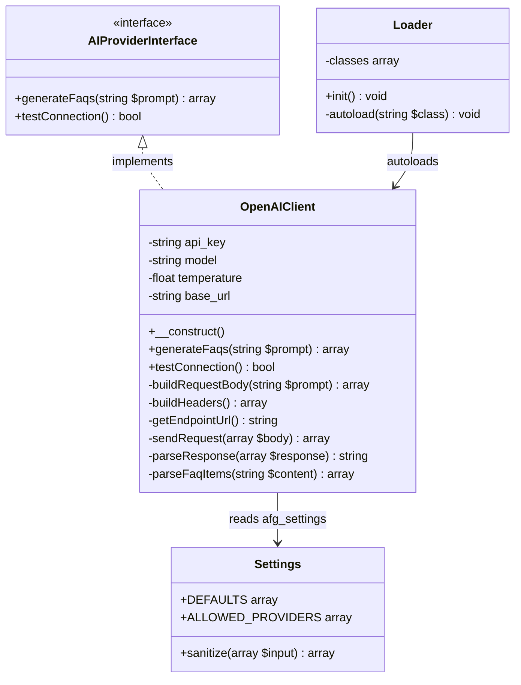
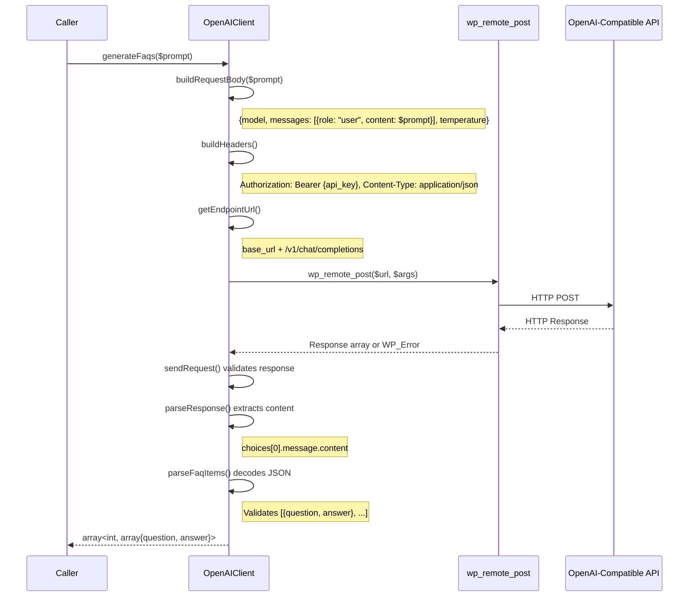
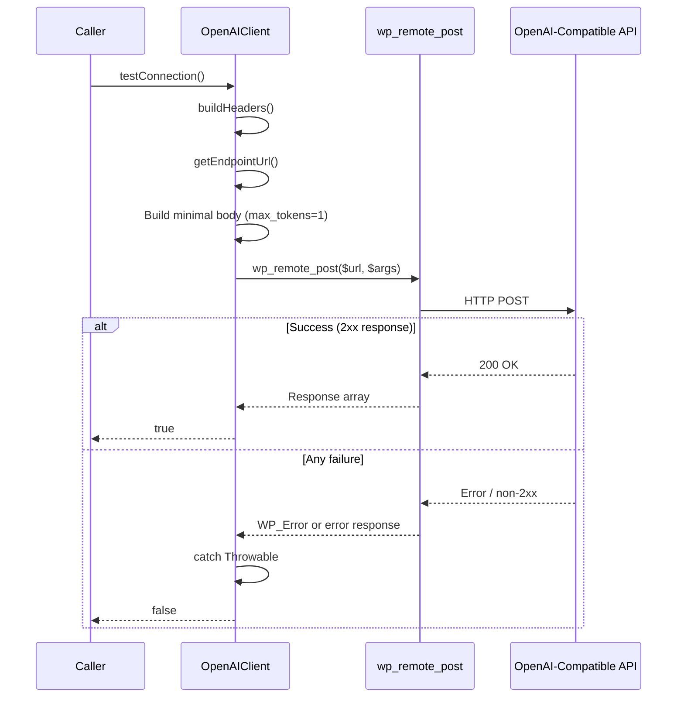
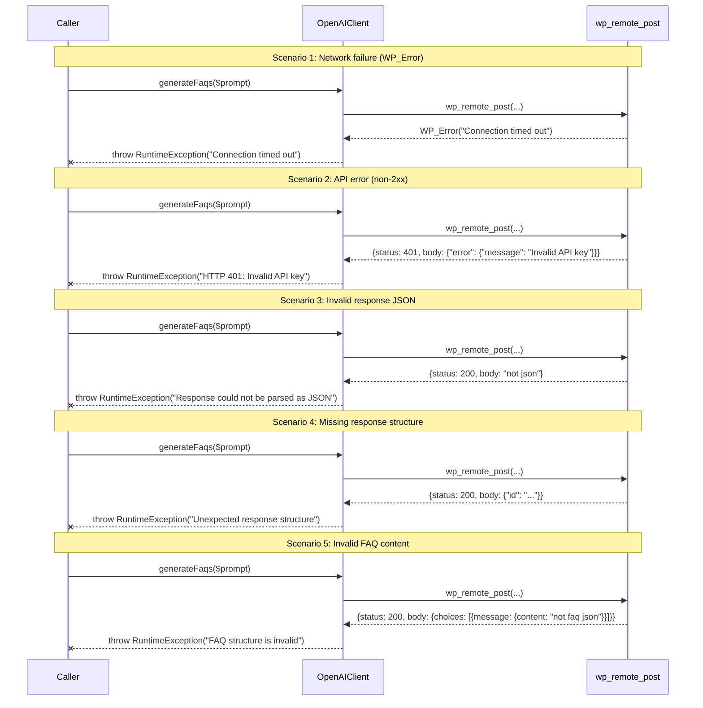

# Design Document: OpenAI Compatible Client

## Overview

The OpenAI Compatible Client is a single PHP class (`OpenAIClient`) that implements `AIProviderInterface` and communicates with any OpenAI-compatible chat completions endpoint. It uses the WordPress HTTP API (`wp_remote_post`) to send requests and parses responses into structured FAQ data. The class reads its configuration (API key, model, temperature, base URL) from the `afg_settings` WordPress option, making it work with OpenAI, OpenRouter, Ollama, DeepSeek, LocalAI, and LM Studio — differentiated only by the `base_url` setting.

The design follows the existing plugin architecture: the `Loader` class registers `OpenAIClient` in its autoloader map, and the `Settings` class is extended with a `base_url` field.

## Architecture



## Components and Interfaces

### Component 1: OpenAIClient

**File**: `includes/class-openai-client.php`
**Namespace**: `WPBits\AiFaqGenerator\Includes`

```php
<?php
declare(strict_types=1);

namespace WPBits\AiFaqGenerator\Includes;

use WPBits\AiFaqGenerator\Includes\Interfaces\AIProviderInterface;

class OpenAIClient implements AIProviderInterface
{
    private string $api_key;
    private string $model;
    private float $temperature;
    private string $base_url;

    /**
     * Read configuration from afg_settings option merged with defaults.
     */
    public function __construct()
    {
        $defaults = [
            'api_key'     => '',
            'model'       => 'gpt-4o',
            'temperature' => 0.7,
            'base_url'    => 'https://api.openai.com',
        ];

        $stored = get_option('afg_settings', []);
        $settings = array_merge($defaults, is_array($stored) ? $stored : []);

        $this->api_key     = (string) $settings['api_key'];
        $this->model       = (string) $settings['model'];
        $this->temperature = (float) $settings['temperature'];
        $this->base_url    = rtrim((string) $settings['base_url'], '/');
    }

    /**
     * Generate FAQ items from the given prompt.
     *
     * @param string $prompt The full prompt (caller provides system instructions).
     * @return array<int, array{question: string, answer: string}>
     * @throws \RuntimeException On any API or parsing error.
     */
    public function generateFaqs(string $prompt): array;

    /**
     * Test connection with a minimal request (max_tokens=1).
     *
     * @return bool True on success, false on any failure (never throws).
     */
    public function testConnection(): bool;

    // ─── Private helpers ─────────────────────────────────────────────

    /**
     * Build the JSON request body for chat completions.
     */
    private function buildRequestBody(string $prompt): array;

    /**
     * Build HTTP headers (Authorization + Content-Type).
     */
    private function buildHeaders(): array;

    /**
     * Construct the full endpoint URL: base_url + /v1/chat/completions
     */
    private function getEndpointUrl(): string;

    /**
     * Send the request via wp_remote_post and validate the raw response.
     *
     * @throws \RuntimeException On WP_Error or non-2xx status.
     */
    private function sendRequest(array $body): array;

    /**
     * Extract assistant message content from the decoded response.
     *
     * @throws \RuntimeException On missing choices[0].message.content path.
     */
    private function parseResponse(array $response): string;

    /**
     * Decode the assistant content into FAQ items and validate structure.
     *
     * @throws \RuntimeException On invalid JSON or missing question/answer keys.
     */
    private function parseFaqItems(string $content): array;
}
```

**Responsibilities**:
- Read configuration from WordPress options on construction
- Build valid OpenAI chat completions request bodies
- Send HTTP requests via `wp_remote_post` with 30-second timeout
- Parse and validate API responses
- Extract and validate FAQ item structure
- Provide safe connection testing (never throws)

### Component 2: Settings (Modified)

**File**: `admin/class-settings.php` (existing, to be modified)

**Changes**:
- Add `'base_url' => 'https://api.openai.com'` to `DEFAULTS` constant
- Add `base_url` sanitization logic in `sanitize()` method using `esc_url_raw()`

```php
// Addition to DEFAULTS:
const DEFAULTS = [
    'provider'    => 'openai',
    'api_key'     => '',
    'model'       => 'gpt-4o',
    'temperature' => 0.7,
    'faq_count'   => 5,
    'base_url'    => 'https://api.openai.com',
];

// Addition to sanitize() method:
// Base URL: validate with esc_url_raw, reject empty/invalid
if (isset($input['base_url'])) {
    $url = esc_url_raw($input['base_url']);
    if (!empty($url)) {
        $sanitized['base_url'] = $url;
    } else {
        $sanitized['base_url'] = $current['base_url'];
    }
} else {
    $sanitized['base_url'] = $current['base_url'];
}
```

### Component 3: Loader (Modified)

**File**: `includes/class-loader.php` (existing, to be modified)

**Changes**:
- Add `OpenAIClient` to the `$this->classes` map

```php
$this->classes = [
    'WPBits\\AiFaqGenerator\\Admin\\Admin' => AFG_PLUGIN_PATH . 'admin/class-admin.php',
    'WPBits\\AiFaqGenerator\\Admin\\Settings' => AFG_PLUGIN_PATH . 'admin/class-settings.php',
    'WPBits\\AiFaqGenerator\\Includes\\Interfaces\\AIProviderInterface' => AFG_PLUGIN_PATH . 'includes/interfaces/class-ai-provider-interface.php',
    'WPBits\\AiFaqGenerator\\Includes\\OpenAIClient' => AFG_PLUGIN_PATH . 'includes/class-openai-client.php',
];
```

## Sequence Diagrams

### generateFaqs() Flow



### testConnection() Flow



### Error Scenarios



## Data Models

### Request Body (generateFaqs)

```json
{
    "model": "gpt-4o",
    "messages": [
        {
            "role": "user",
            "content": "Generate 5 FAQs about WordPress security in JSON format..."
        }
    ],
    "temperature": 0.7
}
```

### Request Body (testConnection)

```json
{
    "model": "gpt-4o",
    "messages": [
        {
            "role": "user",
            "content": "Hi"
        }
    ],
    "temperature": 0.7,
    "max_tokens": 1
}
```

### wp_remote_post Arguments

```php
[
    'headers' => [
        'Authorization' => 'Bearer sk-...',
        'Content-Type'  => 'application/json',
    ],
    'body'    => '{"model":"gpt-4o","messages":[...],"temperature":0.7}',
    'timeout' => 30,
]
```

### API Success Response (chat completions)

```json
{
    "id": "chatcmpl-abc123",
    "object": "chat.completion",
    "created": 1700000000,
    "model": "gpt-4o",
    "choices": [
        {
            "index": 0,
            "message": {
                "role": "assistant",
                "content": "[{\"question\":\"What is WordPress?\",\"answer\":\"WordPress is a CMS...\"}]"
            },
            "finish_reason": "stop"
        }
    ],
    "usage": {
        "prompt_tokens": 50,
        "completion_tokens": 200,
        "total_tokens": 250
    }
}
```

### Parsed FAQ Output

```php
[
    ['question' => 'What is WordPress?', 'answer' => 'WordPress is a CMS...'],
    ['question' => 'Is WordPress free?', 'answer' => 'Yes, WordPress is open source...'],
]
```

### API Error Response

```json
{
    "error": {
        "message": "Incorrect API key provided: sk-****...",
        "type": "invalid_request_error",
        "param": null,
        "code": "invalid_api_key"
    }
}
```

## Correctness Properties

*A property is a characteristic or behavior that should hold true across all valid executions of a system — essentially, a formal statement about what the system should do. Properties serve as the bridge between human-readable specifications and machine-verifiable correctness guarantees.*

### Property 1: Request structure invariant

*For any* valid configuration (any non-empty model string, any temperature in [0.0, 2.0], any non-empty api_key), the request sent by `generateFaqs` SHALL always contain: a JSON body with `model`, `messages` (single element with `role`=`"user"` and `content`=prompt), and `temperature` fields; headers with `Authorization`=`"Bearer {api_key}"` and `Content-Type`=`"application/json"`; and a timeout of 30 seconds.

**Validates: Requirements 1.2, 1.3, 1.4, 1.5**

### Property 2: Response parsing correctness

*For any* valid API response containing a JSON-encoded array of FAQ items at `choices[0].message.content`, the `generateFaqs` method SHALL return a numerically indexed array where every element is an associative array with both a `question` key (non-empty string) and an `answer` key (non-empty string), preserving the content from the API response.

**Validates: Requirements 2.1, 2.2, 2.3**

### Property 3: Error handling completeness

*For any* error condition — `WP_Error` return from `wp_remote_post`, non-2xx HTTP status code, invalid JSON response body, missing `choices[0].message.content` path, or invalid FAQ structure in the content — the `generateFaqs` method SHALL throw a `RuntimeException` with a descriptive message.

**Validates: Requirements 3.1, 3.2, 3.3, 3.4, 3.5**

### Property 4: testConnection never throws

*For any* failure condition (network error, authentication failure, server error, malformed response), the `testConnection` method SHALL return `false` without throwing an exception; and for any successful response (2xx status), it SHALL return `true`.

**Validates: Requirements 4.2, 4.3**

### Property 5: URL construction

*For any* `base_url` string (with or without a trailing slash), the endpoint URL used in requests SHALL equal the `base_url` with trailing slashes removed, followed by `/v1/chat/completions`.

**Validates: Requirements 1.1, 5.4**

## Error Handling

### generateFaqs Error Strategy

| Condition | Exception | Message Pattern |
|-----------|-----------|-----------------|
| `wp_remote_post` returns `WP_Error` | `\RuntimeException` | WP_Error message (e.g., "Connection timed out") |
| HTTP status not 2xx | `\RuntimeException` | `"HTTP {code}: {error_message}"` |
| Response body not valid JSON | `\RuntimeException` | `"Response could not be parsed as JSON"` |
| Missing `choices[0].message.content` | `\RuntimeException` | `"Unexpected response structure: missing choices[0].message.content"` |
| Content not valid FAQ JSON | `\RuntimeException` | `"FAQ structure is invalid: {detail}"` |

### testConnection Error Strategy

`testConnection` wraps the entire request flow in a try/catch:

```php
public function testConnection(): bool
{
    try {
        $body = $this->buildRequestBody('Hi');
        $body['max_tokens'] = 1;
        $this->sendRequest($body);
        return true;
    } catch (\Throwable $e) {
        return false;
    }
}
```

Any exception from network errors, authentication failures, or response parsing is caught and converted to a `false` return. The method never propagates exceptions to the caller.

### Settings base_url Validation

| Condition | Behavior |
|-----------|----------|
| Valid URL provided | Accept after `esc_url_raw()` |
| Empty string | Retain previous stored value |
| Invalid URL (fails `esc_url_raw`) | Retain previous stored value |
| URL with trailing slash | Accepted as-is (client handles trimming) |

## Testing Strategy

### Testing Framework

- **PHPUnit 11** with `#[DataProvider]` attributes (consistent with existing tests)
- **Minimum 100 iterations** per property-based test
- **Mock `wp_remote_post`** via global function override in test bootstrap
- Tests located in `tests/unit/` directory

### Property-Based Tests (PHPUnit Data Providers)

Each correctness property maps to a dedicated test class:

| Property | Test Class | Strategy |
|----------|-----------|----------|
| Property 1: Request structure | `OpenAIClientRequestPropertyTest` | Generate 100+ random configs (model, temperature, api_key, prompt), mock `wp_remote_post` to capture args, verify body/headers/timeout structure |
| Property 2: Response parsing | `OpenAIClientResponsePropertyTest` | Generate 100+ random FAQ arrays, wrap in valid API response format, mock `wp_remote_post` to return them, verify parsed output matches input |
| Property 3: Error handling | `OpenAIClientErrorPropertyTest` | Generate 100+ error conditions (WP_Error, non-2xx codes, invalid JSON, missing paths, invalid FAQ), verify RuntimeException is thrown |
| Property 4: testConnection safety | `OpenAIClientTestConnectionPropertyTest` | Generate 100+ failure conditions, verify `testConnection` returns false without throwing |
| Property 5: URL construction | `OpenAIClientUrlPropertyTest` | Generate 100+ base_url variants (with/without trailing slash, various domains/ports), verify endpoint URL is correctly formed |

### Unit Tests (Example-Based)

- Verify `testConnection` sends `max_tokens=1` in request body
- Verify `Settings::DEFAULTS` contains `base_url` key
- Verify `Loader` class map includes `OpenAIClient` entry
- Verify timeout is exactly 30 seconds

### Test Infrastructure

The test bootstrap already provides:
- `wp_remote_post` stub (to be added for this feature)
- `get_option` / `update_option` stubs (already exist)
- `WP_Error` class stub (to be added)
- `wp_remote_retrieve_response_code` / `wp_remote_retrieve_body` stubs (to be added)
- `esc_url_raw` stub (to be added)

**Tag format**: `Feature: openai-compatible-client, Property N: {property_text}`

### Test Mocking Approach

```php
// Global capture variable for wp_remote_post arguments
global $afg_test_wp_remote_post_args;
global $afg_test_wp_remote_post_return;

function wp_remote_post(string $url, array $args = []) {
    global $afg_test_wp_remote_post_args, $afg_test_wp_remote_post_return;
    $afg_test_wp_remote_post_args = ['url' => $url, 'args' => $args];
    return $afg_test_wp_remote_post_return;
}
```

This allows tests to:
1. Set `$afg_test_wp_remote_post_return` to control what the client receives
2. Read `$afg_test_wp_remote_post_args` to verify what the client sent
