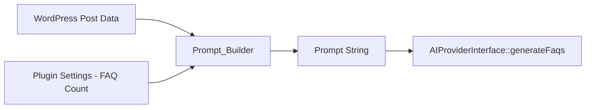

# Design Document: Prompt Builder

## Overview

The Prompt_Builder is a stateless service class that constructs deterministic prompt strings for AI-powered FAQ generation. It accepts post data (title, content) and a FAQ count setting, then produces a well-structured instruction string that directs the AI provider to return a JSON array of question/answer pairs.

The class is a pure function wrapper — given the same inputs, it always produces the same output. It performs input sanitization (HTML stripping), content truncation (2000 character limit), FAQ count validation/clamping, and assembles the final prompt string with clear AI instructions.

This component sits between the WordPress data layer and the `AIProviderInterface`, transforming raw post data into a prompt consumed by `OpenAIClient::generateFaqs()`.

## Architecture



The Prompt_Builder follows the existing plugin architecture:
- Lives in `includes/services/` as a service class
- Registered in the `Loader` class map for autoloading
- No dependencies on external services or WordPress database (receives all inputs as parameters)
- Stateless — no instance properties that change between calls

### Design Decisions

1. **Stateless class with a single public method**: The builder has no constructor dependencies and no mutable state. This makes it trivially testable and deterministic.
2. **Input sanitization via `wp_strip_all_tags`**: Aligns with WordPress conventions and strips all HTML/PHP tags from content before prompt assembly.
3. **Hard truncation at character position**: Content is cut at exactly 2000 characters rather than word-boundary truncation. This keeps the implementation simple and deterministic.
4. **Clamping over exceptions for invalid FAQ count**: Out-of-range values are silently clamped to [1, 20] rather than throwing, which is more resilient in a WordPress plugin context where settings may be corrupted.

## Components and Interfaces

### Prompt_Builder Class

**Namespace:** `WPBits\AiFaqGenerator\Includes\Services`  
**File:** `includes/services/class-prompt-builder.php`

```php
<?php
declare(strict_types=1);

namespace WPBits\AiFaqGenerator\Includes\Services;

class Prompt_Builder
{
    private const CONTENT_LIMIT = 2000;
    private const DEFAULT_FAQ_COUNT = 5;
    private const MIN_FAQ_COUNT = 1;
    private const MAX_FAQ_COUNT = 20;

    /**
     * Build the prompt string from post data and settings.
     *
     * @param string   $post_title   The post title (may contain HTML).
     * @param string   $post_content The post content (may contain HTML).
     * @param int|null $faq_count    Number of FAQs to generate (1-20, default 5).
     * @return string The assembled prompt string.
     */
    public function build(string $post_title, string $post_content, ?int $faq_count = null): string;
}
```

### Internal Methods (private)

| Method | Purpose |
|--------|---------|
| `sanitize_input(string $input): string` | Strips HTML tags via `wp_strip_all_tags`, trims whitespace |
| `truncate_content(string $content): string` | Cuts content to 2000 characters if it exceeds the limit |
| `resolve_faq_count(?int $faq_count): int` | Validates and clamps FAQ count to [1, 20], defaults to 5 |
| `assemble_prompt(string $title, string $content, int $count): string` | Combines all parts into the final prompt string |

### Integration with Existing Code

The `Loader` class will be updated to register the new class in its autoload map:

```php
'WPBits\\AiFaqGenerator\\Includes\\Services\\Prompt_Builder' => AFG_PLUGIN_PATH . 'includes/services/class-prompt-builder.php',
```

The `OpenAIClient::generateFaqs()` method already accepts a `string $prompt` parameter — no changes needed to the AI provider layer.

## Data Models

### Input Parameters

| Parameter | Type | Constraints | Default |
|-----------|------|-------------|---------|
| `post_title` | `string` | Any string, HTML allowed (will be stripped) | — (required) |
| `post_content` | `string` | Any string, HTML allowed (will be stripped, truncated to 2000 chars) | — (required) |
| `faq_count` | `?int` | 1–20 inclusive, clamped if out of range | `5` |

### Output

| Field | Type | Constraints |
|-------|------|-------------|
| Return value | `string` | Non-empty string containing AI instructions, post context, and FAQ count |

### Constants

| Constant | Value | Purpose |
|----------|-------|---------|
| `CONTENT_LIMIT` | `2000` | Maximum character length for post content in prompt |
| `DEFAULT_FAQ_COUNT` | `5` | Default number of FAQs when none specified |
| `MIN_FAQ_COUNT` | `1` | Minimum allowed FAQ count |
| `MAX_FAQ_COUNT` | `20` | Maximum allowed FAQ count |

## Correctness Properties

*A property is a characteristic or behavior that should hold true across all valid executions of a system — essentially, a formal statement about what the system should do. Properties serve as the bridge between human-readable specifications and machine-verifiable correctness guarantees.*

### Property 1: HTML Tag Stripping

*For any* post title or post content string containing HTML tags, the Prompt_Builder output SHALL NOT contain any of those HTML tags — only the text content extracted from within the tags shall appear in the prompt string.

**Validates: Requirements 1.2, 1.3**

### Property 2: Content Truncation Invariant

*For any* post content string, after HTML stripping, the content portion included in the prompt string SHALL have a length equal to `min(length_of_stripped_content, 2000)` characters. Content longer than 2000 characters is cut at exactly the 2000th character position; content at or below 2000 characters is included in full.

**Validates: Requirements 1.4, 1.5**

### Property 3: FAQ Count Clamping

*For any* integer FAQ count value, the number included in the prompt string SHALL equal `clamp(faq_count, 1, 20)` — values below 1 become 1, values above 20 become 20, and values within [1, 20] are used as-is. When FAQ count is null, the value 5 SHALL be used.

**Validates: Requirements 3.1, 3.2, 3.3**

### Property 4: Empty-After-Sanitization Treatment

*For any* input string (title or content) that resolves to an empty string after HTML stripping and whitespace trimming — including whitespace-only strings and HTML-only strings with no text content — the Prompt_Builder SHALL treat that input as absent and not include a corresponding context section in the prompt string.

**Validates: Requirements 4.1, 4.2, 4.3, 4.4, 4.5**

### Property 5: Deterministic Output

*For any* combination of post title, post content, and FAQ count, calling `build()` multiple times with the same arguments SHALL return a byte-for-byte identical prompt string on every invocation, regardless of call order or number of prior invocations.

**Validates: Requirements 5.1, 5.4**

### Property 6: Non-Empty Output

*For any* valid inputs (post title as string, post content as string, FAQ count as integer in [1, 20] or null), the Prompt_Builder SHALL return a non-empty string (minimum 1 character).

**Validates: Requirements 5.2**

### Property 7: Content Inclusion

*For any* non-empty post title and non-empty post content (after sanitization), the prompt string SHALL contain both the sanitized title text and the sanitized (possibly truncated) content text.

**Validates: Requirements 1.1**

## Error Handling

The Prompt_Builder is designed to be resilient and never throw exceptions:

| Scenario | Behavior |
|----------|----------|
| Empty title | Omit title from prompt context |
| Empty content | Omit content from prompt context |
| Both empty | Produce prompt with only instructions and FAQ count |
| HTML-only content (no text) | Treat as empty content |
| Whitespace-only input | Treat as empty |
| FAQ count < 1 | Clamp to 1 |
| FAQ count > 20 | Clamp to 20 |
| FAQ count is null | Default to 5 |
| Content exceeds 2000 chars | Truncate at character 2000 |

No exceptions are thrown. All edge cases produce valid, non-empty prompt strings. This ensures the downstream `AIProviderInterface::generateFaqs()` always receives a usable prompt.

## Testing Strategy

### Property-Based Tests (PHPUnit DataProvider)

The project uses PHPUnit 11 with `DataProvider` attributes to achieve property-based testing by generating 100+ random inputs per property. This matches the existing test patterns in the codebase (see `LoaderPropertyTest.php`).

**Library:** PHPUnit 11 with `#[DataProvider]` attributes  
**Minimum iterations:** 100 per property  
**Tag format:** `Feature: prompt-builder, Property {number}: {property_text}`

Each correctness property maps to one test method with a data provider generating 100+ random inputs:

| Property | Test Class | Generator Strategy |
|----------|-----------|-------------------|
| Property 1: HTML Stripping | `PromptBuilderHtmlStrippingPropertyTest` | Random strings wrapped in random HTML tags (`<p>`, `<div>`, `<span>`, `<a href="...">`, etc.) |
| Property 2: Truncation | `PromptBuilderTruncationPropertyTest` | Random strings of varying lengths (0 to 5000 chars) |
| Property 3: FAQ Count Clamping | `PromptBuilderFaqCountPropertyTest` | Random integers from -100 to 100, plus null |
| Property 4: Empty-After-Sanitization | `PromptBuilderEmptyInputPropertyTest` | Random whitespace strings, HTML-only strings, mixed |
| Property 5: Determinism | `PromptBuilderDeterminismPropertyTest` | Random title/content/count combinations, called twice |
| Property 6: Non-Empty Output | `PromptBuilderNonEmptyPropertyTest` | Random valid inputs including edge cases |
| Property 7: Content Inclusion | `PromptBuilderInclusionPropertyTest` | Random non-empty title/content pairs |

### Unit Tests (Example-Based)

For the static instruction requirements (2.1, 2.2, 2.3) and specific edge cases:

| Test | Validates |
|------|-----------|
| Output contains JSON array instruction | Requirement 2.1 |
| Output contains question/answer key instruction | Requirement 2.2 |
| Output contains raw-JSON-only instruction | Requirement 2.3 |
| Null FAQ count defaults to 5 | Requirement 3.2 |
| Empty title omits title section | Requirement 4.1 |
| Empty content omits content section | Requirement 4.2 |
| Both empty produces valid prompt | Requirement 4.3 |

### Test Bootstrap

The existing `tests/bootstrap.php` already stubs WordPress functions. A `wp_strip_all_tags` stub will be added to match the existing pattern:

```php
if (!function_exists('wp_strip_all_tags')) {
    function wp_strip_all_tags(string $text, bool $remove_breaks = false): string
    {
        $text = strip_tags($text);
        if ($remove_breaks) {
            $text = preg_replace('/[\r\n\t ]+/', ' ', $text);
        }
        return trim($text);
    }
}
```

