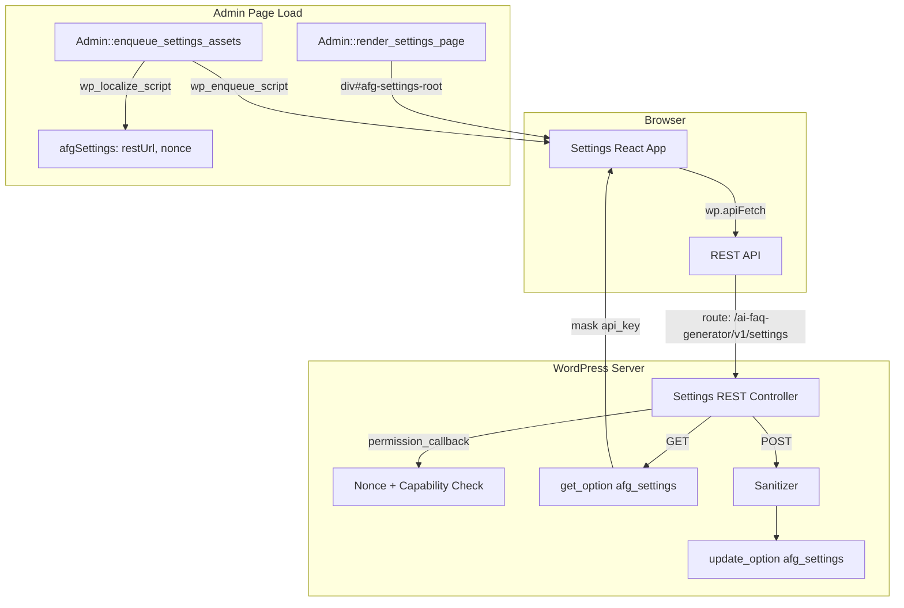
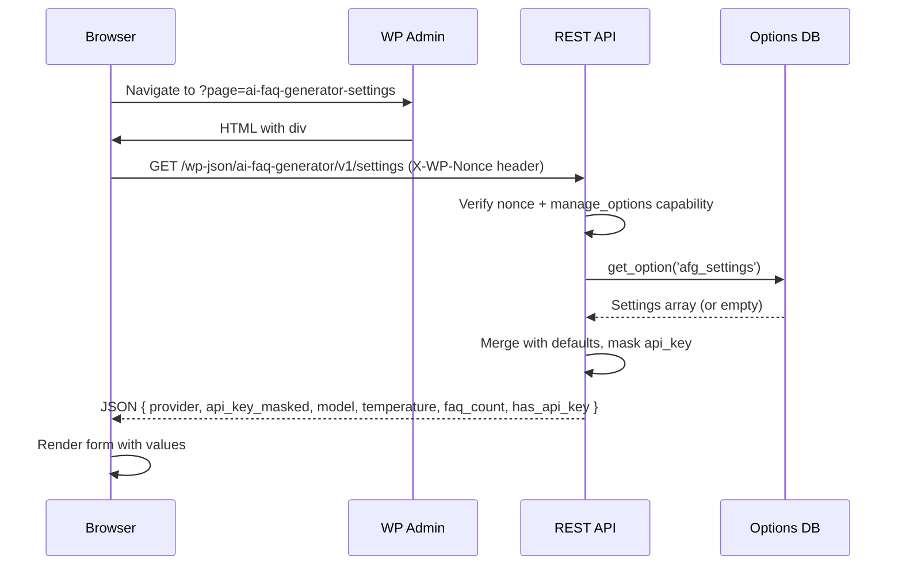
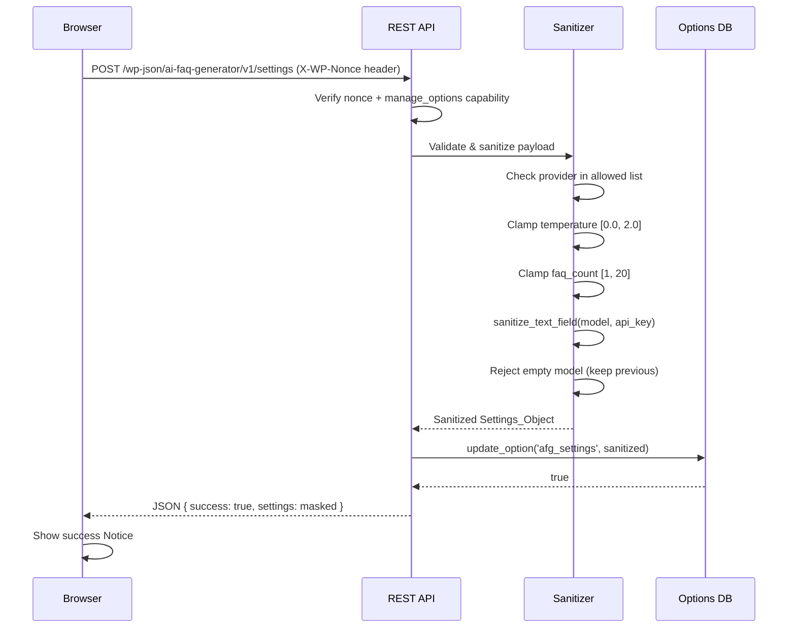

# Design Document: Settings Storage

## Overview

The Settings Storage feature adds a React-based settings page to the AI FAQ Generator plugin. The frontend uses `@wordpress/components` (TextControl, SelectControl, RangeControl) and communicates with a custom REST API endpoint (`ai-faq-generator/v1/settings`). The backend PHP `Settings` class handles sanitization, validation, persistence via the WordPress Options API, and API key masking. Scripts are conditionally enqueued only on the settings admin page.

The architecture follows the existing plugin patterns: the `Loader` class registers the new `Settings` class, the `Admin` class renders a mount point div, and a separate Webpack entry point (`src/settings/index.js`) builds the React app independently from the main plugin bundle.

## Architecture



## Sequence Diagrams

### Settings Page Load



### Settings Save



## Components and Interfaces

### Component 1: Settings (PHP Class)

**File**: `admin/class-settings.php`

**Purpose**: Registers the REST API route, handles GET/POST logic, sanitizes input, masks API key in responses.

**Interface**:
```php
namespace WPBits\AiFaqGenerator\Admin;

class Settings {
    const OPTION_KEY = 'afg_settings';
    const REST_NAMESPACE = 'ai-faq-generator/v1';
    const REST_ROUTE = '/settings';

    const DEFAULTS = [
        'provider'    => 'openai',
        'api_key'     => '',
        'model'       => 'gpt-4o',
        'temperature' => 0.7,
        'faq_count'   => 5,
    ];

    const ALLOWED_PROVIDERS = [
        'openai', 'openrouter', 'ollama', 'deepseek', 'localai', 'lmstudio'
    ];

    public function init(): void;
    public function register_routes(): void;
    public function permission_check(\WP_REST_Request $request): bool;
    public function get_settings(\WP_REST_Request $request): \WP_REST_Response;
    public function update_settings(\WP_REST_Request $request): \WP_REST_Response;
    private function sanitize(array $input): array;
    private function mask_api_key(string $key): string;
}
```

**Responsibilities**:
- Register REST route with `register_rest_route()` on `rest_api_init`
- Enforce `manage_options` capability in `permission_check()`
- Return merged defaults + stored settings on GET (with masked API key)
- Sanitize and persist settings on POST
- Return masked settings in POST response

### Component 2: Admin (PHP Class — Extended)

**File**: `admin/class-admin.php` (existing, to be modified)

**Purpose**: Conditionally enqueue the settings React bundle and localize REST data.

**New Methods**:
```php
public function enqueue_settings_assets(string $hook_suffix): void;
```

**Responsibilities**:
- Hook into `admin_enqueue_scripts` with the hook suffix check
- Only enqueue when `$hook_suffix === 'ai-faq_page_ai-faq-generator-settings'`
- Enqueue `build/settings.js` and `build/settings.css`
- Use `wp_localize_script()` to pass `afgSettings` object with `restUrl` and `nonce`
- Render a `<div id="afg-settings-root"></div>` mount point in `render_settings_page()`

### Component 3: Settings React App

**File**: `src/settings/index.js` (new entry point)

**Purpose**: Render the settings form, fetch/save settings via REST API.

**Interface**:
```javascript
// src/settings/index.js — Entry point
import { render } from '@wordpress/element';
import SettingsPage from './SettingsPage';

render(<SettingsPage />, document.getElementById('afg-settings-root'));
```

```javascript
// src/settings/SettingsPage.js — Main component
import { useState, useEffect } from '@wordpress/element';
import { Button, Notice, Spinner, TextControl, SelectControl, RangeControl, Panel, PanelBody } from '@wordpress/components';
import apiFetch from '@wordpress/api-fetch';

function SettingsPage() {
    // State: settings object, isSaving, notice
    // On mount: GET settings
    // On submit: POST settings
    // Render: form fields + save button + notices
}

export default SettingsPage;
```

**Responsibilities**:
- Fetch current settings on mount via `apiFetch`
- Render form fields using `@wordpress/components`
- Display masked API key placeholder when key exists
- Submit settings via POST, show success/error Notice
- Disable submit button and show Spinner while saving

### Component 4: Loader (PHP Class — Extended)

**File**: `includes/class-loader.php` (existing, to be modified)

**Purpose**: Register the Settings class in the autoloader and initialize it.

**Changes**:
- Add `Settings` class path to `$this->classes` map
- Instantiate and call `$settings->init()` inside `init()` (alongside Admin)

## Data Models

### Settings_Object (PHP)

```php
[
    'provider'    => string,  // One of ALLOWED_PROVIDERS
    'api_key'     => string,  // Raw key stored, never exposed in responses
    'model'       => string,  // Free-text, sanitized, non-empty
    'temperature' => float,   // 0.0 – 2.0
    'faq_count'   => int,     // 1 – 20
]
```

**Validation Rules**:
- `provider` must be in `ALLOWED_PROVIDERS` array
- `api_key` is sanitized with `sanitize_text_field()`
- `model` is sanitized with `sanitize_text_field()`, must not be empty/whitespace-only
- `temperature` is cast to float and clamped to `[0.0, 2.0]`
- `faq_count` is cast to int and clamped to `[1, 20]`

### REST Response (GET)

```json
{
    "provider": "openai",
    "api_key": "sk-****...****",
    "model": "gpt-4o",
    "temperature": 0.7,
    "faq_count": 5,
    "has_api_key": true
}
```

**Notes**:
- `api_key` is always masked in responses (first 3 + last 4 chars visible, rest replaced with `****`)
- `has_api_key` boolean tells the frontend whether a key is stored (so it can show placeholder text)

### REST Response (POST — Success)

```json
{
    "success": true,
    "settings": {
        "provider": "openai",
        "api_key": "sk-****...****",
        "model": "gpt-4o",
        "temperature": 0.7,
        "faq_count": 5,
        "has_api_key": true
    }
}
```

### REST Response (POST — Error)

```json
{
    "code": "rest_forbidden",
    "message": "You do not have permission to manage settings.",
    "data": { "status": 403 }
}
```

## File Structure

```
plugins/ai-faq-generator/
├── admin/
│   ├── class-admin.php          (modified: enqueue + mount point)
│   └── class-settings.php       (new: REST controller + sanitizer)
├── includes/
│   └── class-loader.php         (modified: register Settings class)
├── src/
│   ├── index.js                 (existing: main plugin entry)
│   └── settings/
│       ├── index.js             (new: settings entry point)
│       └── SettingsPage.js      (new: React settings component)
├── build/
│   ├── index.js                 (existing: main bundle)
│   ├── settings.js              (generated: settings bundle)
│   └── settings.css             (generated: settings styles)
└── package.json                 (modified: add settings entry in wp-scripts config)
```

## Error Handling

### Scenario 1: Unauthorized Access

**Condition**: REST request without valid nonce or from user lacking `manage_options`
**Response**: 403 Forbidden with `rest_forbidden` error code
**Recovery**: Frontend displays error Notice; user must re-authenticate

### Scenario 2: Invalid Provider Value

**Condition**: POST body contains a provider not in `ALLOWED_PROVIDERS`
**Response**: Sanitizer rejects the value, retains previously stored provider
**Recovery**: Response returns the current (unchanged) settings; frontend re-renders with stored value

### Scenario 3: Empty Model Field

**Condition**: POST body contains empty or whitespace-only model string
**Response**: Sanitizer rejects the value, retains previously stored model
**Recovery**: Response returns the current (unchanged) settings; frontend re-renders with stored value

### Scenario 4: Network Failure

**Condition**: `apiFetch` call fails due to network error
**Response**: Frontend catches the error in the Promise rejection
**Recovery**: Error Notice displayed with failure reason; form remains editable for retry

## Testing Strategy

### Unit Testing Approach (PHP)

- Test `Settings::sanitize()` with valid and invalid inputs
- Test `Settings::mask_api_key()` with various key lengths
- Test `Settings::permission_check()` with mocked capabilities
- Test default values are returned when no option exists
- Use PHPUnit with WordPress test framework (already configured)

### Unit Testing Approach (JavaScript)

- Test `SettingsPage` component renders all form fields
- Test form submission triggers apiFetch with correct payload
- Test success/error notices appear based on response
- Test loading state disables submit button
- Use `@wordpress/scripts test-unit` with Jest + React Testing Library

### Integration Testing Approach

- Test full REST round-trip: POST settings → GET settings → verify persistence
- Test nonce validation rejects unauthenticated requests
- Test capability check rejects non-admin users

## Security Considerations

- API key is never returned in full via REST responses — only masked representation
- API key is never rendered in HTML page source (React fetches it masked via REST)
- All REST endpoints require valid `wp_rest` nonce via `X-WP-Nonce` header
- All REST endpoints require `manage_options` capability
- All text inputs are sanitized with `sanitize_text_field()` before storage
- No direct database queries — uses WordPress Options API exclusively

## Performance Considerations

- Settings bundle is only loaded on the settings page (conditional enqueue)
- Single `get_option()` call retrieves all settings (stored as single serialized array)
- No additional database queries beyond the single option read/write
- React bundle is small (only `@wordpress/components` + `@wordpress/api-fetch`)

## Correctness Properties

*A property is a characteristic or behavior that should hold true across all valid executions of a system — essentially, a formal statement about what the system should do. Properties serve as the bridge between human-readable specifications and machine-verifiable correctness guarantees.*

### Property 1: Settings round-trip persistence

*For any* valid Settings_Object (valid provider, non-empty model, temperature in [0.0, 2.0], faq_count in [1, 20]), saving it via POST then retrieving it via GET SHALL return an equivalent object (with the API key masked but all other fields identical).

**Validates: Requirements 1.1, 1.2**

### Property 2: Invalid provider rejection

*For any* string that is not in the allowed providers list (openai, openrouter, ollama, deepseek, localai, lmstudio), the sanitizer SHALL reject it and the stored provider value SHALL remain unchanged.

**Validates: Requirement 3.1**

### Property 3: Numeric field clamping

*For any* numeric value provided for temperature or faq_count, the sanitizer SHALL clamp the value to its valid range ([0.0, 2.0] for temperature, [1, 20] for faq_count) such that the stored value is always `max(min, min(max, input))`.

**Validates: Requirements 3.2, 3.3**

### Property 4: Whitespace model rejection

*For any* string composed entirely of whitespace characters (including the empty string), the sanitizer SHALL reject it as a model value and the stored model SHALL remain unchanged.

**Validates: Requirement 3.4**

### Property 5: API key masking

*For any* stored API key string of length ≥ 7, the REST GET response SHALL never contain the full key value; it SHALL return a masked representation where only the first 3 and last 4 characters are visible.

**Validates: Requirement 4.4**

### Property 6: Text field sanitization

*For any* string containing HTML tags or script content provided as model or api_key, the sanitizer SHALL strip all HTML/script tags (equivalent to WordPress `sanitize_text_field()` behavior) before storage.

**Validates: Requirement 3.5**

## Dependencies

- **PHP**: WordPress 6.0+, PHP 7.4+
- **JavaScript**: `@wordpress/scripts` (build tooling), `@wordpress/components`, `@wordpress/element`, `@wordpress/api-fetch`
- **WordPress APIs**: REST API, Options API, Nonce API, `wp_enqueue_script`, `wp_localize_script`
