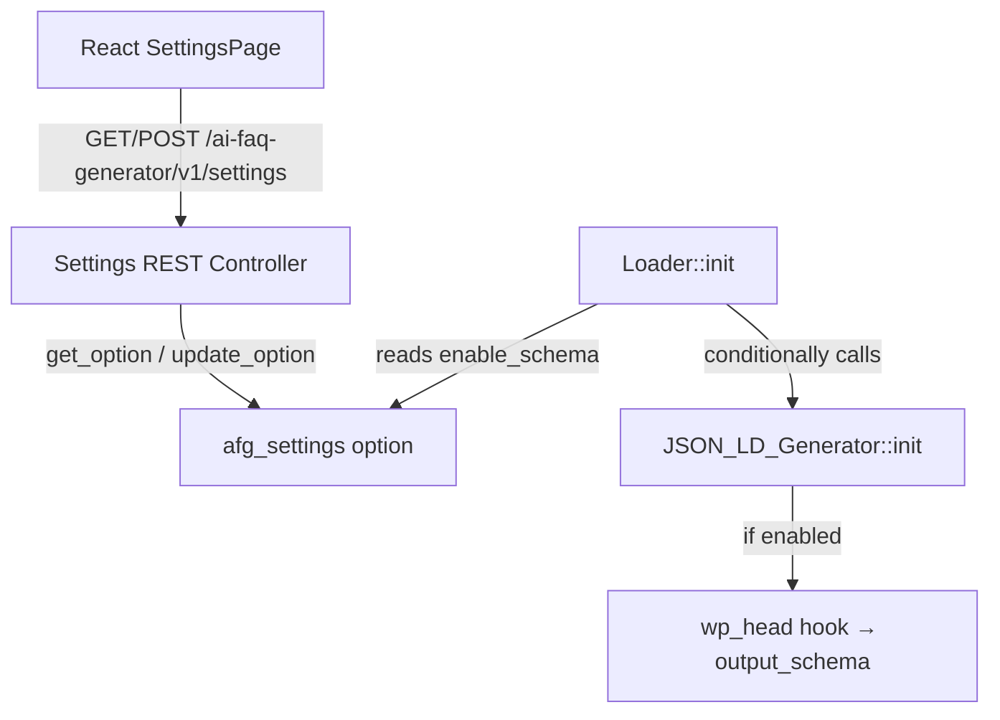

# Design Document: Toggle Schema

## Overview

This feature adds an `enable_schema` boolean setting to the AI FAQ Generator plugin, allowing administrators to control whether FAQPage JSON-LD structured data is output in the document `<head>`. The setting integrates into the existing `afg_settings` option, is exposed through the existing REST API endpoint, and is surfaced as a checkbox in the React-based settings page. The JSON_LD_Generator conditionally registers its `wp_head` hook based on this setting at initialization time.

The design follows the existing patterns established in the codebase: the Settings class handles sanitization and REST exposure, the Loader orchestrates initialization, and the React SettingsPage component consumes the REST API.

## Architecture

The feature touches four existing components with minimal modifications:



**Data Flow:**

1. **Read path**: SettingsPage → GET endpoint → Settings class reads `afg_settings` → returns `enable_schema` (defaults `true` if absent)
2. **Write path**: SettingsPage → POST endpoint → Settings class sanitizes (casts to bool) → persists to `afg_settings`
3. **Execution path**: Loader reads `afg_settings['enable_schema']` at init → only calls `JSON_LD_Generator::init()` if truthy or absent

## Components and Interfaces

### 1. Settings Class (`admin/class-settings.php`)

**Changes:**

- Add `'enable_schema' => true` to `DEFAULTS` constant
- Modify `get_settings()` to include `enable_schema` as a boolean in the response
- Modify `update_settings()` to include `enable_schema` in the response
- Modify `sanitize()` to handle `enable_schema` field with boolean casting

**Sanitization logic for `enable_schema`:**

```php
// enable_schema: cast to boolean using PHP rules
if (array_key_exists('enable_schema', $input)) {
    $sanitized['enable_schema'] = (bool) $input['enable_schema'];
} else {
    $sanitized['enable_schema'] = $current['enable_schema'];
}
```

Key detail: uses `array_key_exists` rather than `isset` so that `null` values are detected and cast to `false` per PHP boolean casting rules (Requirement 1.4).

### 2. Loader Class (`includes/class-loader.php`)

**Changes:**

- Before calling `$json_ld_generator->init()`, read the `afg_settings` option and check `enable_schema`
- If `enable_schema` is explicitly `false`, skip initialization of JSON_LD_Generator
- If the key is absent or `true`, proceed with initialization (preserves backward compatibility)

```php
// Initialize JSON-LD structured data output (frontend) — conditionally.
$afg_settings = get_option(Settings::OPTION_KEY, []);
$enable_schema = $afg_settings['enable_schema'] ?? true;

if ($enable_schema !== false) {
    $json_ld_generator = new Services\JSON_LD_Generator();
    $json_ld_generator->init();
}
```

This satisfies Requirement 4.4: the setting is evaluated at hook registration time during plugin initialization, not deferred to render time.

### 3. React SettingsPage (`src/settings/SettingsPage.js`)

**Changes:**

- Add `enable_schema: true` to the default state
- Add a `CheckboxControl` component (from `@wordpress/components`) labeled "Enable FAQ Schema"
- Include `enable_schema` in the POST payload on form submission
- Bind checkbox checked state to `settings.enable_schema`

```jsx
import { CheckboxControl } from '@wordpress/components';

// In the form, within a new PanelBody or the existing one:
<CheckboxControl
    label="Enable FAQ Schema"
    help="Output FAQPage JSON-LD structured data in the page head for posts with generated FAQs."
    checked={ settings.enable_schema }
    onChange={ ( value ) =>
        setSettings( { ...settings, enable_schema: value } )
    }
/>
```

### 4. JSON_LD_Generator (`includes/services/class-json-ld-generator.php`)

**No changes required.** The conditional logic lives in the Loader. If `enable_schema` is false, `JSON_LD_Generator::init()` is never called, so no `wp_head` hook is registered.

## Data Models

### Settings Option (`afg_settings`)

The `afg_settings` option is an associative array stored in the `wp_options` table. The new field:

| Key | Type | Default | Description |
|-----|------|---------|-------------|
| `enable_schema` | `bool` | `true` | Controls whether FAQPage JSON-LD is output on the frontend |

**Full option shape after this feature:**

```php
[
    'provider'      => string,   // AI provider identifier
    'api_key'       => string,   // API key (stored raw)
    'model'         => string,   // Model identifier
    'temperature'   => float,    // [0.0, 2.0]
    'faq_count'     => int,      // [1, 20]
    'base_url'      => string,   // Provider base URL
    'enable_schema' => bool,     // JSON-LD output toggle
]
```

### REST API Response Shape

**GET `/ai-faq-generator/v1/settings`:**

```json
{
    "provider": "openai",
    "api_key": "sk-****abcd",
    "model": "gpt-4o",
    "temperature": 0.7,
    "faq_count": 5,
    "base_url": "https://api.openai.com",
    "has_api_key": true,
    "enable_schema": true
}
```

**POST `/ai-faq-generator/v1/settings` response:**

```json
{
    "success": true,
    "settings": {
        "provider": "openai",
        "api_key": "sk-****abcd",
        "model": "gpt-4o",
        "temperature": 0.7,
        "faq_count": 5,
        "base_url": "https://api.openai.com",
        "has_api_key": true,
        "enable_schema": false
    }
}
```


## Correctness Properties

*A property is a characteristic or behavior that should hold true across all valid executions of a system — essentially, a formal statement about what the system should do. Properties serve as the bridge between human-readable specifications and machine-verifiable correctness guarantees.*

### Property 1: Sanitizer always produces boolean `enable_schema`

*For any* input array passed to `Settings::sanitize()` (whether it contains `enable_schema` with any value, or omits it entirely), the returned array SHALL always contain an `enable_schema` key with a value of PHP type `bool`.

**Validates: Requirements 1.1, 2.1**

### Property 2: Boolean casting matches PHP rules

*For any* value provided as `enable_schema` in the input to `Settings::sanitize()` (including integers, strings, null, floats, arrays, and objects), the resulting stored boolean SHALL equal `(bool) $input_value` per PHP's standard type-casting rules — where `0`, `"0"`, `""`, `null`, `[]`, and `false` resolve to `false`, and all other non-empty values resolve to `true`.

**Validates: Requirements 1.3, 1.4, 2.5**

### Property 3: Omitted field preserves current stored value

*For any* currently stored boolean value of `enable_schema` (either `true` or `false`), if a POST input array omits the `enable_schema` key entirely, the sanitizer output SHALL contain an `enable_schema` value identical to the previously stored value.

**Validates: Requirements 2.4**

### Property 4: Conditional initialization correctness

*For any* `afg_settings` option state, the JSON_LD_Generator `wp_head` hook SHALL be registered if and only if the `enable_schema` value is `true` or the key is absent from the option. When `enable_schema` is explicitly `false`, no `wp_head` hook SHALL be registered by JSON_LD_Generator.

**Validates: Requirements 4.1, 4.2, 4.3**

## Error Handling

| Scenario | Behavior |
|----------|----------|
| `afg_settings` option missing entirely | `get_option` returns `[]`, merged with `DEFAULTS` → `enable_schema` defaults to `true` |
| `enable_schema` key absent from stored option | Treated as `true` (backward compatible with pre-feature installs) |
| Non-boolean value passed via REST POST | Cast to `bool` using PHP rules before storage; no error returned |
| `null` value passed for `enable_schema` | Cast to `false` via `(bool) null`; persisted as `false` |
| REST API error on Settings_Page load | Error notice displayed; checkbox preserved in last-known state (default `true` on first load) |
| REST API error on Settings_Page save | Error notice displayed; local checkbox state unchanged; no option mutation |
| Invalid JSON in POST body | WordPress REST infrastructure returns 400 before reaching sanitize logic |
| Permission denied (non-admin user) | `permission_check` returns `false`; WordPress returns 403 |

## Testing Strategy

### PHP Unit Tests (PHPUnit)

**Example-based tests:**
- Default value: GET response returns `enable_schema: true` when key is absent from stored option
- Explicit true/false: POST with `enable_schema: true` and `enable_schema: false` both persist and return correctly
- Initialization check: Verify option is read at init time, not at render time (Requirement 4.4)

**Property-based tests (PHPUnit DataProvider pattern with 100+ iterations):**

The project uses PHPUnit with DataProvider-generated inputs (as seen in `SettingsPropertyTest.php`). Each property test generates 100+ random inputs plus edge cases.

| Property | Test File | Iterations |
|----------|-----------|-----------|
| Property 1: Sanitizer always produces boolean | `EnableSchemaTypePropertyTest.php` | 100+ |
| Property 2: Boolean casting matches PHP rules | `EnableSchemaCastingPropertyTest.php` | 100+ |
| Property 3: Omitted field preserves value | `EnableSchemaPreservationPropertyTest.php` | 100+ |
| Property 4: Conditional initialization | `EnableSchemaInitPropertyTest.php` | 100+ |

**Tag format:** Each test is annotated with:
```
Feature: toggle-schema, Property {N}: {property_text}
```

### JavaScript Unit Tests (Jest + fast-check)

The project already includes `fast-check` as a dev dependency. JavaScript property tests will use fast-check for generation.

**Example-based tests:**
- Checkbox renders with label "Enable FAQ Schema"
- Checkbox reflects `enable_schema` state from API response (checked/unchecked)
- Form submission includes `enable_schema` in POST payload
- Error notice displayed on API failure; checkbox state preserved

**Property-based tests (fast-check, 100+ iterations):**

| Property | Description | Iterations |
|----------|-------------|-----------|
| Checkbox state reflects boolean | *For any* boolean value returned by the API, the checkbox `checked` attribute matches that value | 100+ |

### Test Configuration

- PHP property tests: 100 random inputs + ~10 edge cases per property via `DataProvider`
- JS property tests: `fc.assert(property, { numRuns: 100 })`
- Both test suites run in CI without network dependencies (all WordPress functions mocked)
